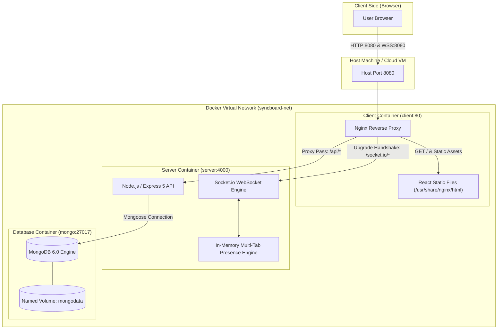

# Full-Stack DevOps & Realtime Architecture Guide
### Production-Grade Guide for Containerization, Reverse Proxies, WebSockets, and CI/CD

---

## 📌 Executive Summary & Architecture Overview

This document provides a comprehensive, field-tested reference blueprint for containerizing, orchestrating, and deploying modern full-stack web applications featuring:
1. **Single Page Application (SPA)** frontend built with **React** and **Vite**.
2. **REST API & Real-Time Server** built with **Node.js**, **Express**, and **Socket.io**.
3. **Database Layer** utilizing **MongoDB** with persistent storage.
4. **Nginx Reverse Proxy** acting as the single front door for static asset serving, SPA routing, API pass-through, and persistent WebSocket connection upgrades.
5. **Multi-Stage Containerization** with **Docker** and multi-service orchestration via **Docker Compose**.
6. **Automated CI/CD Workflows** powered by **GitHub Actions**.

### System Architecture Diagram



---

## 🔍 Identified Features & Practices in this Repository

| Area | Component / File | Identified DevOps & Engineering Practice |
| :--- | :--- | :--- |
| **Reverse Proxy** | `client/nginx.conf` | Single entry-point architecture, SPA deep-link fallback (`try_files`), same-origin zero-CORS API routing, WebSocket upgrade proxying (`HTTP/1.1`, `Upgrade`, `Connection`). |
| **Frontend Container** | `client/Dockerfile` | Multi-stage Docker build (`node:20-alpine` build stage $\rightarrow$ `nginx:alpine` runtime stage). Injects build-time environment arguments (`VITE_API_URL=""`). |
| **Backend Container** | `server/Dockerfile` | Layer caching optimization (`package*.json` first), `--omit=dev` production installation, unprivileged non-root execution (`USER node`), explicit `NODE_ENV=production`. |
| **Orchestration** | `docker-compose.yml` | Healthcheck-driven dependency startup (`condition: service_healthy`), isolated internal networking (only port 8080 exposed), persistent named volume (`mongodata`). |
| **Realtime WebSockets** | `src/server.js`<br>`src/pages/SyncBoard.jsx` | Combined HTTP & Socket.io server, JWT handshake authentication, room-based broadcast routing, multi-tab presence tracking with Map-of-Maps, client reconnection state recovery. |
| **Controller Realtime Bridge** | `src/controllers/taskController.js` | Express app sharing `io` instance (`app.set('io', io)`), allowing REST mutations to immediately broadcast real-time events. |
| **Health Checks & Observability** | `app.js`<br>`src/middleware/` | Readiness/liveness probe endpoint (`/api/health`) validating DB status, request correlation IDs (`x-request-id`), structured request logging. |
| **Automated Testing** | `tests/`<br>`src/pages/SyncBoard.test.jsx` | Integration tests for presence tracking, socket events, connection errors, and multi-tab connection counting logic. |
| **CI / CD Automation** | `.github/workflows/ci.yml` | Parallel testing matrix on GitHub Actions (client Vitest with coverage + server Jest tests), artifact upload (`coverage/` and `reports/`). |

---

## 1. Nginx Reverse Proxy & WebSocket Configuration

### Purpose & Advantages
- **Single Origin (Zero CORS in Production)**: When both frontend assets (`/`) and backend services (`/api/`, `/socket.io/`) are served behind the same Nginx origin (`http://localhost:8080`), the browser does not enforce cross-origin restrictions. No CORS preflight overhead.
- **SPA Routing Support**: Client-side routing libraries (like React Router) fail with `404 Not Found` when a user refreshes deep URLs (e.g. `/tasks/123`). Nginx's `try_files` redirects missing paths back to `/index.html`.
- **WebSocket Upgrade Handling**: WebSockets start as an HTTP request and "upgrade" to a persistent TCP connection. Nginx must explicitly forward the upgrade headers.

### File: `client/nginx.conf`

```nginx
server {
    listen 80;
    root /usr/share/nginx/html;

    # 1. Single Page Application (SPA) Deep-Linking Fallback
    location / {
        try_files $uri $uri/ /index.html;
    }

    # 2. REST API Reverse Proxy (Same-origin routing)
    location /api/ {
        proxy_pass http://server:4000;
        proxy_set_header Host $host;
        proxy_set_header X-Real-IP $remote_addr;
        proxy_set_header X-Forwarded-For $proxy_add_x_forwarded_for;
        proxy_set_header X-Forwarded-Proto $scheme;
    }

    # 3. Socket.io / WebSocket Handshake & Persistent Connection
    location /socket.io/ {
        proxy_pass http://server:4000;
        proxy_http_version 1.1;
        proxy_set_header Upgrade $http_upgrade;
        proxy_set_header Connection "upgrade";
        proxy_set_header Host $host;
        proxy_cache_bypass $http_upgrade;
        
        # Optional: extend timeouts for idle persistent connections
        proxy_read_timeout 86400s;
        proxy_send_timeout 86400s;
    }
}
```

#### Key Directives Explained:
- `try_files $uri $uri/ /index.html;`: Tries to match a static file or folder; if neither exists, falls back to `/index.html` so the React router handles the route.
- `proxy_http_version 1.1;`: WebSockets require HTTP/1.1; Nginx defaults to HTTP/1.0 for proxies unless specified.
- `proxy_set_header Upgrade $http_upgrade;` & `proxy_set_header Connection "upgrade";`: Passes the hop-by-hop upgrade headers to the Node.js backend.
- `http://server:4000`: Refers to the internal Docker DNS service name (`server`) on internal port `4000`.

---

## 2. Production Containerization (Dockerfiles)

### 2.1 Frontend: Multi-Stage Dockerfile (`client/Dockerfile`)

Multi-stage builds allow us to compile the client application with heavy Node.js tooling, but package only the production build artifacts into a lightweight alpine Nginx image (~25MB), leaving zero source code or build tools in the final image.

```dockerfile
# ==========================================
# Stage 1: Build the React application with Vite
# ==========================================
FROM node:20-alpine AS build
WORKDIR /app

# Cache dependency layer
COPY package*.json ./
RUN npm ci

# Copy build config and source code
COPY index.html vite.config.js ./
COPY src ./src

# Build argument: empty string means relative paths ('/api' & '/socket.io') via Nginx
ARG VITE_API_URL=""
ENV VITE_API_URL=$VITE_API_URL

# Generate production build in /app/dist
RUN npm run build

# ==========================================
# Stage 2: Production Nginx Server
# ==========================================
FROM nginx:alpine

# Copy compiled static assets from build stage
COPY --from=build /app/dist /usr/share/nginx/html

# Copy custom Nginx configuration
COPY client/nginx.conf /etc/nginx/conf.d/default.conf

EXPOSE 80
CMD ["nginx", "-g", "daemon off;"]
```

---

### 2.2 Backend: Hardened Node.js Dockerfile (`server/Dockerfile`)

```dockerfile
FROM node:20-alpine
WORKDIR /app

# 1. Dependency caching: copy lockfiles first
COPY package*.json ./

# 2. Install production dependencies only (no devDependencies like Jest/Babel)
RUN npm ci --omit=dev

# 3. Copy application code
COPY app.js ./
COPY src ./src

# 4. Set environment
ENV NODE_ENV=production
EXPOSE 4000

# 5. Security Hardening: Never run container processes as root
USER node

# 6. Start server
CMD ["node", "src/server.js"]
```

#### Docker Security & Performance Best Practices:
1. **Layer Caching**: `COPY package*.json ./` before `COPY src ./src`. Changing a JavaScript file won't re-trigger slow `npm install` runs during builds.
2. **`--omit=dev`**: Reduces Docker image size by 70%+ and removes test runners/compilers that are attack vectors in production.
3. **`USER node`**: Alpine Node images include an unprivileged `node` user (UID 1000). Running as non-root prevents container breakout privilege escalation.
4. **Alpine Linux Base**: `node:20-alpine` has a drastically smaller CVE vulnerability footprint compared to standard Debian-based images.

---

## 3. Multi-Container Orchestration (`docker-compose.yml`)

Docker Compose coordinates service discovery, startup sequencing, environment injection, and volume persistence.

```yaml
# docker-compose.yml
services:
  # -------------------------------------------------------------
  # 1. Database Service
  # -------------------------------------------------------------
  mongo:
    image: mongo:6
    restart: unless-stopped
    volumes:
      - mongodata:/data/db # Data persists across container restarts
    healthcheck:
      test: ["CMD", "mongosh", "--quiet", "--eval", "db.adminCommand('ping')"]
      interval: 10s
      timeout: 5s
      retries: 5
      start_period: 10s

  # -------------------------------------------------------------
  # 2. Node.js API & WebSocket Server
  # -------------------------------------------------------------
  server:
    build:
      context: .
      dockerfile: server/Dockerfile
    restart: unless-stopped
    environment:
      PORT: 4000
      MONGO_URI: mongodb://mongo:27017/syncboard
      JWT_SECRET: ${JWT_SECRET:-fallback_secret_key_change_in_prod}
      CLIENT_ORIGIN: http://localhost:8080
    depends_on:
      mongo:
        condition: service_healthy # Wait until MongoDB is actively accepting queries

  # -------------------------------------------------------------
  # 3. Nginx Reverse Proxy & React Client
  # -------------------------------------------------------------
  client:
    build:
      context: .
      dockerfile: client/Dockerfile
      args:
        VITE_API_URL: "" # Relative path: all requests route via Nginx
    ports:
      - "8080:80" # Only public-facing port exposed to the host!
    restart: unless-stopped
    depends_on:
      - server

# ---------------------------------------------------------------
# Named Persistent Volumes
# ---------------------------------------------------------------
volumes:
  mongodata:
```

### Orchestration Insights:
- **Port Isolation**: Note that `mongo` (27017) and `server` (4000) have **no `ports:` section**. They are reachable **only** by other containers on Docker's private bridge network. Only Nginx (`client:8080:80`) is exposed to the outside world.
- **Healthcheck-Driven Startup**: Standard `depends_on: [mongo]` only waits for the container process to spawn, not for MongoDB to finish disk initialization. Using `condition: service_healthy` ensures the Node server does not crash with connection-refused errors on startup.

---

## 4. Real-Time WebSockets & Multi-Tab Presence Engine

### 4.1 Server Architecture (`src/server.js`)

When implementing real-time WebSockets with Express and Socket.io, structure the server to handle:
1. HTTP Server wrapping Express.
2. Socket authentication via JWT in handshake.
3. Multi-connection accounting per user (handling multiple browser tabs).
4. Cross-cutting communication between Express REST controllers and Socket rooms.

```javascript
// src/server.js
import { createServer } from 'node:http';
import { Server } from 'socket.io';
import mongoose from 'mongoose';
import jwt from 'jsonwebtoken';
import app from '../app.js';
import { config } from './config.js';

// 1. Wrap Express app inside HTTP server
const httpServer = createServer(app);

// 2. Initialize Socket.io with CORS configuration
export const io = new Server(httpServer, {
    cors: {
        origin: config.clientOrigin,
        credentials: true
    }
});

// 3. Make 'io' available inside Express controllers via req.app.get('io')
app.set('io', io);

// 4. In-Memory Presence Data Structure:
// Map<boardId, Map<userId, connectionCount>>
export const presence = new Map();

export function announce(boardId) {
    const users = [...(presence.get(boardId)?.keys() ?? [])];
    io.to(`board:${boardId}`).emit("presence:update", users);
}

// 5. Socket Authentication Middleware
io.use((socket, next) => {
    const token = socket.handshake.auth?.token;
    if (!token) return next(new Error('NO_TOKEN'));

    try {
        const payload = jwt.verify(token, config.jwtSecret);
        socket.user = { id: payload.sub, email: payload.email };
        next();
    } catch {
        next(new Error('BAD_TOKEN'));
    }
});

// 6. Socket Connection Lifecycle
io.on('connection', (socket) => {
    // Join personal user room for targeted notifications
    if (socket.user?.id) {
        socket.join(`user:${socket.user.id}`);
    }

    // Join a collaborative room
    socket.on("board:join", (boardId) => {
        if (!boardId || typeof boardId !== "string") return;

        const room = `board:${boardId}`;
        socket.join(room);
        socket.emit('board:joined', room);

        // Track user tab connection count
        const board = presence.get(boardId) ?? new Map();
        const currentCount = board.get(socket.user.id) ?? 0;
        board.set(socket.user.id, currentCount + 1);
        presence.set(boardId, board);

        announce(boardId);
    });

    // Handle Disconnect (use 'disconnecting' to read socket.rooms before they are left)
    socket.on("disconnecting", () => {
        for (const room of socket.rooms) {
            if (!room.startsWith("board:")) continue;

            const boardId = room.slice("board:".length);
            const board = presence.get(boardId);
            if (!board) continue;

            const remaining = (board.get(socket.user.id) ?? 1) - 1;
            if (remaining > 0) {
                board.set(socket.user.id, remaining);
            } else {
                board.delete(socket.user.id);
            }

            announce(boardId);
        }
    });
});

// 7. Start Server
async function startServer() {
    try {
        await mongoose.connect(config.mongoUri);
        httpServer.listen(config.port, () => {
            console.log(`Server listening on port ${config.port}`);
        });
    } catch (err) {
        console.error('Database connection failed:', err);
        process.exit(1);
    }
}

if (process.env.NODE_ENV !== 'test') {
    startServer();
}

export { httpServer };
```

---

### 4.2 Emitting Real-Time Events from REST Controllers

Whenever a database mutation occurs in an Express route (e.g. `POST /api/tasks`), notify the connected WebSocket clients in the appropriate room:

```javascript
// src/controllers/taskController.js
export async function create(req, res, next) {
    try {
        // 1. Mutate database
        const task = await Task.create(req.body);

        // 2. Retrieve the Socket.io instance from Express app
        const io = req.app.get("io");

        // 3. Broadcast to clients in the room
        io?.to("board:main").emit("task:created", task);

        // 4. Return standard HTTP 201 response
        res.status(201).json(task);
    } catch (error) {
        next(error);
    }
}
```

---

### 4.3 Client Connection, Resync, & Teardown Lifecycle

In the React frontend (`SyncBoard.jsx`), implement three crucial resilience patterns:
1. **JWT Handshake**: Pass token in `auth: { token }`.
2. **Reconnection State Recovery**: On reconnect (`onConnect`), re-emit `board:join` AND HTTP-fetch latest state (`refetchBoard()`) to catch updates missed during temporary network dropouts.
3. **Explicit Cleanup**: Disconnect and unbind listeners in `useEffect` return handler to avoid zombie connections in React 18/19 StrictMode.

```javascript
// src/pages/SyncBoard.jsx (Core Lifecycle Pattern)
useEffect(() => {
    const token = localStorage.getItem('token');
    if (!token) return;

    // Connect using relative URL in production (via Nginx) or dev fallback
    const socket = io(import.meta.env.VITE_API_URL || 'http://localhost:5000', {
        auth: { token }
    });

    const onConnect = async () => {
        setOnline(true);
        // 1. Re-join the room (rooms are lost across reconnections)
        socket.emit('board:join', boardId);
        // 2. Fetch fresh state via REST to bridge missed events
        await refetchBoard();
    };

    const onDisconnect = (reason) => {
        setOnline(false);
        if (reason === 'io server disconnect') {
            socket.connect(); // Reconnect if server kicked
        }
    };

    socket.on('connect', onConnect);
    socket.on('disconnect', onDisconnect);
    socket.on('presence:update', (users) => setOnlineUsers(users));
    socket.on('task:created', (newTask) => {
        setTasks((prev) => prev.some(t => t._id === newTask._id) ? prev : [...prev, newTask]);
    });

    // Cleanup on component unmount
    return () => {
        socket.off('connect', onConnect);
        socket.off('disconnect', onDisconnect);
        socket.disconnect();
    };
}, [boardId]);
```

---

## 5. Health Checks & Observability

A production server should expose clear liveness and readiness probes for orchestrators (Docker Compose, Kubernetes, AWS ECS).

```javascript
// app.js
import express from 'express';
import mongoose from 'mongoose';

const app = express();

app.get('/api/health', (req, res) => {
    const isDbConnected = mongoose.connection.readyState === 1;

    const health = {
        status: isDbConnected ? 'ok' : 'degraded',
        uptime: process.uptime(),
        timestamp: new Date().toISOString(),
        database: isDbConnected ? 'connected' : 'disconnected'
    };

    res.status(isDbConnected ? 200 : 503).json(health);
});
```

---

## 6. Continuous Integration (GitHub Actions CI)

A robust CI workflow runs parallel matrix checks on every pull request and push to `main`.

### File: `.github/workflows/ci.yml`

```yaml
name: CI

on:
  push:
    branches: [main]
  pull_request:

jobs:
  # -------------------------------------------------------------
  # Job 1: Client Linting & Vitest Coverage
  # -------------------------------------------------------------
  client:
    runs-on: ubuntu-latest
    steps:
      - name: Checkout Code
        uses: actions/checkout@v4

      - name: Setup Node.js
        uses: actions/setup-node@v4
        with:
          node-version: '22'
          cache: npm

      - name: Install Dependencies
        run: npm ci

      - name: Run Linter
        run: npm run lint

      - name: Run Client Unit & Component Tests
        run: npx vitest run --coverage

      - name: Upload Client Coverage Artifacts
        uses: actions/upload-artifact@v4
        if: always()
        with:
          name: client-coverage
          path: coverage/
          if-no-files-found: ignore

  # -------------------------------------------------------------
  # Job 2: Server API & Integration Tests
  # -------------------------------------------------------------
  server:
    runs-on: ubuntu-latest
    steps:
      - name: Checkout Code
        uses: actions/checkout@v4

      - name: Setup Node.js
        uses: actions/setup-node@v4
        with:
          node-version: '22'
          cache: npm

      - name: Install Dependencies
        run: npm ci

      - name: Run Server API & Presence Tests
        run: npm run test:server

      - name: Upload Server Test Reports
        uses: actions/upload-artifact@v4
        if: always()
        with:
          name: server-test-report
          path: reports/
          if-no-files-found: ignore
```

---

## 7. Step-by-Step Blueprint for Replicating in Any New Project

Follow this sequence whenever introducing this stack into a new repository:

### Step 1: Project Directory Structure
Create this clean separation:

```text
my-project/
├── .github/
│   └── workflows/
│       └── ci.yml
├── client/
│   ├── Dockerfile
│   └── nginx.conf
├── server/
│   └── Dockerfile
├── src/
│   ├── controllers/
│   ├── middleware/
│   ├── models/
│   ├── routes/
│   ├── pages/
│   ├── config.js
│   └── server.js
├── tests/
│   ├── health.test.js
│   └── presence.test.js
├── .env.example
├── .gitignore
├── app.js
├── docker-compose.yml
├── package.json
└── vite.config.js
```

### Step 2: Configure Environment Variables
1. Ensure `.env.example` has defaults:
   ```env
   PORT=4000
   MONGO_URI=mongodb://127.0.0.1:27017/myapp
   JWT_SECRET=your_jwt_secret_here
   CLIENT_ORIGIN=http://localhost:5173
   ```
2. In `docker-compose.yml`, supply container service names:
   ```env
   MONGO_URI=mongodb://mongo:27017/myapp
   CLIENT_ORIGIN=http://localhost:8080
   ```

### Step 3: Set Up Nginx Reverse Proxy
Place the `client/nginx.conf` matching the template in Section 1. Ensure `proxy_pass http://server:4000;` points to your backend container name and port.

### Step 4: Configure Multi-Stage Builds
- Place `client/Dockerfile` (Node 20 build $\rightarrow$ Nginx alpine).
- Place `server/Dockerfile` with `USER node` and `--omit=dev`.

### Step 5: Test Docker Orchestration Locally
Run the stack:
```bash
# 1. Build and boot all containers
docker compose up --build -d

# 2. Check running container status and health
docker compose ps

# 3. View streaming logs
docker compose logs -f

# 4. Verify endpoints
curl http://localhost:8080/api/health

# 5. Teardown
docker compose down
```

---

## 8. Common Pitfalls & Troubleshooting Checklist

| Symptom / Issue | Root Cause | Solution |
| :--- | :--- | :--- |
| **WebSocket handshake fails with HTTP 400** | Nginx is missing `proxy_set_header Upgrade` or `proxy_http_version 1.1`. | Ensure `location /socket.io/` contains `proxy_http_version 1.1;` and both `Upgrade` and `Connection "upgrade"` headers. |
| **React Router deep link gives 404 on page refresh** | Nginx does not know about client-side routes. | Add `try_files $uri $uri/ /index.html;` to `location /` in `nginx.conf`. |
| **Node.js server crashes immediately on `docker compose up`** | Server started before MongoDB was ready to accept TCP connections. | In `docker-compose.yml`, configure MongoDB healthcheck (`mongosh ping`) and set `depends_on: { mongo: { condition: service_healthy } }`. |
| **`USER node` permission denied on file write** | The container is running as unprivileged `node` user (UID 1000), but host mount or directory is owned by `root`. | Ensure created directories inside Dockerfile are chowned: `RUN chown -R node:node /app`. |
| **Client makes API calls to `localhost:5000` in production** | Vite environment variables are baked in at build time (`npm run build`). | Set `ARG VITE_API_URL=""` in `client/Dockerfile` so client uses relative URLs (`/api/...`), naturally routing via Nginx. |
| **Data lost after `docker compose down`** | Using anonymous Docker volumes instead of named volumes. | Specify named volume `volumes: [ mongodata:/data/db ]` and declare `volumes: { mongodata: }`. |
