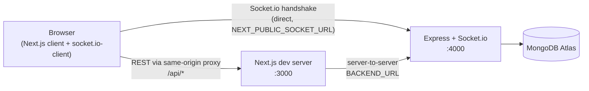
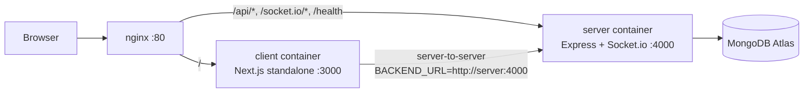

# FlowERP

FlowERP is a small-business ERP system — a Kanban-style Sales & Orders
board, plus Invoicing, Inventory, Shipments, and Production tracking, all
kept in sync live across every open client via Socket.io. Built for the
PUSL 3120 Full-Stack Development group project.

## Tech stack

| Layer | Technology |
|---|---|
| Frontend | Next.js 16 (App Router), React 19, TypeScript, Tailwind CSS v4 |
| Backend | Node.js + Express, routes/controllers/models structure |
| Database | MongoDB Atlas via Mongoose |
| Real-time | Socket.io (server + client), authenticated over the session cookie |
| Auth | Custom JWT session (httpOnly cookie), register/login/logout, role-gated routes |
| Testing | Playwright (E2E), Jest + React Testing Library (frontend unit), Jest + Supertest (server integration, ephemeral `mongodb-memory-server`) |
| CI | GitHub Actions — runs backend + frontend tests on every push/PR; see [Testing](#testing) |
| DevOps | Docker (multi-stage builds for client + server), nginx reverse proxy, Docker Compose |

See [`CLAUDE.md`](CLAUDE.md) for the full build log and architecture
rationale, [`docs/schema-diagram.md`](docs/schema-diagram.md) for the
database schema, and [`API_CONTRACT.md`](API_CONTRACT.md) for the full API
reference.

## Architecture

**Local development** — frontend and backend run as two separate
processes on two ports; the browser reaches the backend directly for the
Socket.io handshake, and through the Next.js app's own same-origin proxy
for every REST call (avoids third-party-cookie blocking — see
`src/app/api/[...path]/route.ts`).



**Docker Compose / production** — nginx becomes the single public entry
point (port 80). It path-routes `/` to the client container, `/api/` and
`/socket.io/` (with WebSocket upgrade headers) to the server container,
and `/health` to the server's health check — see
[`nginx/nginx.conf`](nginx/nginx.conf).



MongoDB stays the real Atlas cluster in every environment (local dev,
Docker Compose, and production) rather than a containerized `mongo`
service — see [Known limitations](#known-limitations).

## Setup

### Option A — local dev (two processes)

**Frontend:**

```bash
npm install
cp .env.example .env   # fill in JWT_SECRET, BACKEND_URL, NEXT_PUBLIC_SOCKET_URL — see comments in the file
npm run dev             # http://localhost:3000
```

**Backend:**

```bash
cd server
npm install
cp .env.example .env   # fill in MONGODB_URI and JWT_SECRET — see comments in the file
npm run seed             # creates the admin/admin@123 account
npm run dev               # http://localhost:4000
```

Run both at once from the root with `npm run dev:all`. Default login:
**admin / admin@123**.

### Option B — Docker Compose

```bash
cp server/.env.example server/.env   # fill in MONGODB_URI and JWT_SECRET
cd server && npm run seed && cd ..    # creates the admin account, run once against the same MONGODB_URI
docker compose up --build             # http://localhost — nginx is the single entry point
```

See [`docker-compose.yml`](docker-compose.yml)'s own comments for how the
three containers (`client`, `server`, `nginx`) are wired together, and why
`JWT_SECRET` is read from `server/.env` by both app containers rather than
kept as two separate copies.

## Testing

**End-to-end (Playwright + Chromium)** — drives the real running app in
an actual browser; specs live in `testing/e2e/`. Includes a login smoke
test and a full multi-client flow test (`full-flow-live-sync.spec.ts`)
that opens two independent browser sessions and proves the Socket.io
layer works end to end: client A creates an order, confirms it, invoices
it, ships it (dispatch + deliver), and schedules a linked production job
— entirely through the real UI — while client B, on the same screens,
watches every one of those changes appear live without ever reloading or
refetching.

```bash
npm run test:e2e                    # headless — auto-starts npm run dev:all if it's not already running
npm run test:e2e -- --headed        # watch it run in an actual browser window
npm run test:e2e -- --ui            # interactive UI mode — best for debugging
npm run test:e2e -- --debug         # pauses on failure with the Playwright Inspector
```

No HTML report is generated by default (console output only) — add
`--reporter=html` to any command above, then run `npx playwright show-report`
to view it.

**Frontend unit (Jest + React Testing Library)** — component-level tests;
specs live in `testing/unit/`.

```bash
npm run test:unit
```

**Backend (Jest + Supertest)** — integration tests against the real
Express app and Mongoose models, backed by an ephemeral in-memory MongoDB
(`mongodb-memory-server`) so nothing ever touches the real Atlas cluster;
specs live in `server/src/__tests__/`.

```bash
cd server
npm test
```

**CI** — [`.github/workflows/ci.yml`](.github/workflows/ci.yml) checks out
the repo, sets up Node 20 with npm caching for both `package-lock.json`
files, installs both apps' dependencies, and runs the backend
(Jest + Supertest) and frontend (Jest + React Testing Library) suites on
every push/PR — neither needs any repository secrets, since the backend
suite starts its own ephemeral in-memory MongoDB and the frontend suite
is pure component tests. The Playwright E2E suite is a deliberate
follow-up — it drives the real running app against a real MongoDB
connection, so it needs a test `MONGODB_URI`/secrets configured in the
repo first — see the commented block at the bottom of that file.

## Project structure

```
src/            Next.js frontend — domain classes, components, app routes
server/         Express + Mongoose backend — routes/controllers/models
testing/        Playwright (e2e/) and frontend Jest (unit/) specs
docs/           Schema diagram, bug report, REST design guide
nginx/          Reverse proxy config for Docker Compose
Dockerfile      Multi-stage build for the Next.js client
server/Dockerfile   Multi-stage build for the Express server
docker-compose.yml  Wires client + server + nginx together
```

## Known limitations

- **MongoDB is not containerized.** `docker-compose.yml` runs `client`,
  `server`, and `nginx`; `MONGODB_URI` in `server/.env` points at the real
  Atlas cluster in every environment, matching how the project has run
  since M3. A local `mongo` service was deliberately left out rather than
  adding a second, disconnected copy of the database that `npm run seed`
  and the rest of the team's local dev environments don't share.
- **Socket.io auth relies on `SameSite=Lax`, not a cross-domain token.**
  The handshake reuses the same `flowerp_token` cookie the REST API
  trusts. That works for local dev (different ports, same host) and
  Docker Compose (nginx puts everything on one origin), but would need an
  explicit token-based handshake if the frontend and backend ever end up
  on genuinely different domains in production — see
  `server/src/realtime/socket.ts`'s own comment.
- **CI runs the backend and frontend suites but not E2E yet** (see
  [Testing](#testing) above) — Playwright is deliberately deferred until a
  dedicated test `MONGODB_URI`/secrets are configured for GitHub Actions,
  since it drives the real app against a real MongoDB connection rather
  than the ephemeral in-memory database the other two suites use.
- **Real-time sync covers Sales & Orders, Invoicing, Shipments, and the
  Production board** (Order, Order Draft, Invoice, Shipment, and
  Production Job broadcast changes over Socket.io — see
  `server/src/utils/socket.ts`'s `emitEvent` callers). Settings →
  Customers/Suppliers/Products/Users, Inventory, and the Dashboard's
  activity feed/revenue series still require a manual refresh to see
  another client's changes.
- **A handful of buttons are visual stubs** (New Invoice's PDF download,
  Send reminder, Adjust stock) — see CLAUDE.md's "Deliberate differences
  from the static mockup" for the full list and why.
