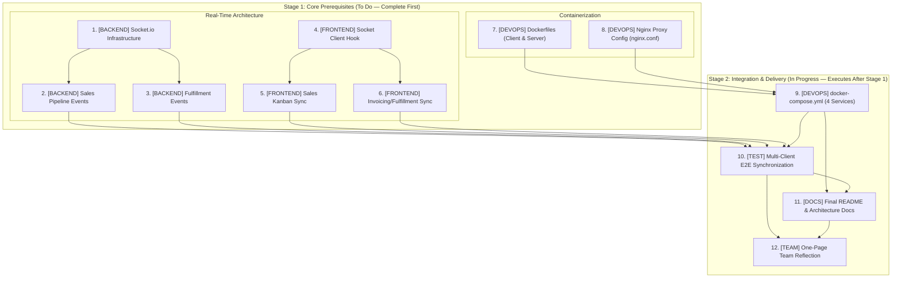
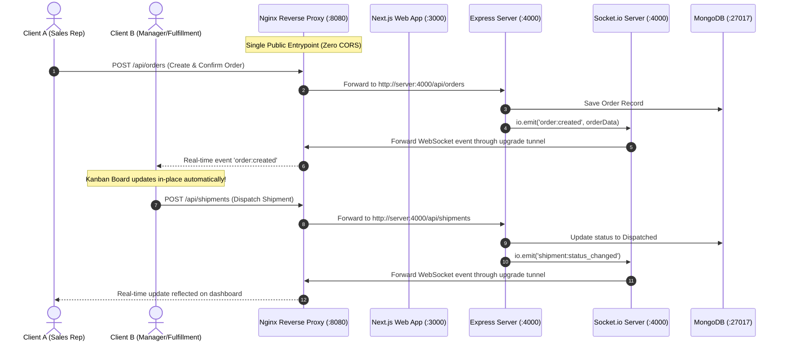

# Milestone 5: Real-Time, DevOps & Launch — Task Breakdown

**Project:** FlowERP  
**Milestone:** M5 (Final Milestone)  
**Objective:** Implement real-time bi-directional synchronization (Socket.io), containerize the application (Docker & Compose) behind an Nginx reverse proxy, execute comprehensive multi-client end-to-end testing, and complete final project documentation and team reflection.

---

## 📌 Team Workflow & Phasing Convention

> [!IMPORTANT]
> **Team Status Convention:**
> - **Stage 1 (`🟡 To Do` — Core Prerequisites):** Tasks 1 to 8. These are the foundational code, real-time events, Dockerfiles, and Nginx configurations. Team members must work on and complete these tasks first.
> - **Stage 2 (`🔵 In Progress` — Post-Prerequisite Downstream Tasks):** Tasks 9 to 12. In our team's setup, "In Progress" designates the final integration, verification, and launch phase that **must be executed after all Stage 1 prerequisite tasks are completed**.



---

## 📋 Task Allocation & Status Summary

### Stage 1: Core Implementation Tasks (`🟡 To Do` — Must Complete First)

| # | Domain | Task Description | Status | Assignee | Priority | Target Scope / Files |
|---|--------|------------------|--------|----------|----------|----------------------|
| **1** | `[BACKEND]` | Socket.io server infrastructure & authenticated handshake | 🟡 To Do | _[Assignee]_ | High | `server/src/server.ts`, `server/src/utils/socket.ts` |
| **2** | `[BACKEND]` | Real-time events — Sales pipeline (Orders, Drafts, Invoices) | 🟡 To Do | _[Assignee]_ | High | `order.controller.ts`, `orderDraft.controller.ts`, `invoice.controller.ts` |
| **3** | `[BACKEND]` | Real-time events — Fulfillment (Shipments, Production Jobs) | 🟡 To Do | _[Assignee]_ | High | `shipment.controller.ts`, `productionJob.controller.ts` |
| **4** | `[FRONTEND]` | Socket.io client connection (same-origin/Nginx-ready) + live-update hook | 🟡 To Do | _[Assignee]_ | High | `src/app/(app)/layout.tsx`, `src/hooks/useLiveEvent.ts`, `src/lib/socket.ts` |
| **5** | `[FRONTEND]` | Live-sync Sales & Order Board | 🟡 To Do | _[Assignee]_ | High | `src/app/(app)/sales/page.tsx` (Kanban Board) |
| **6** | `[FRONTEND]` | Live-sync Invoicing, Shipments & Production board | 🟡 To Do | _[Assignee]_ | High | `src/app/(app)/invoicing/`, `shipments/`, `production/` |
| **7** | `[DEVOPS]` | Write Dockerfiles (Next.js standalone client + Express server) | 🟡 To Do | _[Assignee]_ | Medium | `Dockerfile` (or `Dockerfile.client`), `server/Dockerfile` |
| **8** | `[DEVOPS]` | Configure Nginx reverse proxy (`nginx.conf`) | 🟡 To Do | _[Assignee]_ | High | `nginx/nginx.conf` (or `client/nginx.conf`) |

---

### Stage 2: Integration, Verification & Launch (`🔵 In Progress` — Executed After Stage 1)

| # | Domain | Task Description | Status | Preceding Dependencies | Assignee | Priority | Target Scope / Files |
|---|--------|------------------|--------|------------------------|----------|----------|----------------------|
| **9** | `[DEVOPS]` | Write `docker-compose.yml` (client + server + MongoDB + Nginx) | 🔵 In Progress *(Post-Stage 1)* | Tasks 7 & 8 (Dockerfiles & Nginx config) | _[Assignee]_ | High | `docker-compose.yml`, `.env.docker` |
| **10** | `[TEST]` | End-to-end test: Full pipeline multi-client live-sync | 🔵 In Progress *(Post-Stage 1)* | Tasks 1–6 & Task 9 | _[Assignee]_ | High | Cross-browser / Dual-client manual & E2E verification |
| **11** | `[DOCS]` | Final README & architecture documentation | 🔵 In Progress *(Post-Stage 1)* | Tasks 9 & 10 (Docker stack & verified E2E flow) | _[Assignee]_ | Medium | `README.md`, Architecture diagrams, deployment guides |
| **12** | `[TEAM]` | One-page team reflection | 🔵 In Progress *(Post-Stage 1)* | Tasks 1–11 (Full milestone completion) | _[Assignee]_ | Medium | `TEAM_REFLECTION.md` / Milestone submission doc |

---

## 🛠️ Detailed Task Specifications

### Stage 1 Tasks: Core Building Blocks (Must Complete First)

#### 1. [BACKEND] Socket.io Server Infrastructure & Authenticated Handshake
- **Stage:** Stage 1 (Prerequisite)
- **Status:** `🟡 To Do`
- **Assignee:** `[Unassigned]`
- **Target Files:**
  - `server/src/server.ts`
  - `server/src/config/socket.ts` (or `server/src/utils/socket.ts`)
- **Key Deliverables & Specifications:**
  - [ ] Attach Socket.io to the existing Express/HTTP server instance.
  - [ ] Configure CORS for Socket.io matching `CLIENT_ORIGIN` (support local dev `http://localhost:3000` as well as Nginx `http://localhost:8080`).
  - [ ] Authenticate incoming connections during handshake middleware by verifying the `flowerp_token` JWT cookie.
  - [ ] Reject unauthenticated or expired handshake attempts with `BAD_TOKEN` / `NO_TOKEN`.
  - [ ] Export a singleton `io` instance or helper (`getIO()`) so controllers can seamlessly trigger broadcasts.

---

#### 2. [BACKEND] Real-Time Events — Sales Pipeline (Orders, Order Drafts, Invoices)
- **Stage:** Stage 1 (Prerequisite)
- **Status:** `🟡 To Do`
- **Assignee:** `[Unassigned]`
- **Target Files:**
  - `server/src/controllers/order.controller.ts`
  - `server/src/controllers/orderDraft.controller.ts`
  - `server/src/controllers/invoice.controller.ts`
- **Key Deliverables & Specifications:**
  - [ ] Add `io.emit('order:created', data)` and `io.emit('order:updated', data)` on order creation and status transition.
  - [ ] Add `io.emit('order_draft:approved', data)` and draft mutation events in `orderDraft.controller.ts`.
  - [ ] Add `io.emit('invoice:created', data)` and `io.emit('invoice:paid', data)` in `invoice.controller.ts`.
  - [ ] Ensure payload data is sanitized and contains all necessary fields for frontend state reconciliation without requiring an explicit refetch.

---

#### 3. [BACKEND] Real-Time Events — Fulfillment (Shipments, Production Jobs)
- **Stage:** Stage 1 (Prerequisite)
- **Status:** `🟡 To Do`
- **Assignee:** `[Unassigned]`
- **Target Files:**
  - `server/src/controllers/shipment.controller.ts`
  - `server/src/controllers/productionJob.controller.ts`
- **Key Deliverables & Specifications:**
  - [ ] Add `io.emit('shipment:created', data)` on new shipment generation.
  - [ ] Add `io.emit('shipment:status_changed', data)` on dispatch / delivery updates.
  - [ ] Add `io.emit('production_job:updated', data)` on stage progression (queued → in-progress → completed).
  - [ ] Validate error handling so socket broadcast failures do not block the primary HTTP transaction.

---

#### 4. [FRONTEND] Socket.io Client Connection (Same-Origin / Nginx-Ready) + Shared Hook
- **Stage:** Stage 1 (Prerequisite)
- **Status:** `🟡 To Do`
- **Assignee:** `[Unassigned]`
- **Target Files:**
  - `src/app/(app)/layout.tsx`
  - `src/hooks/useLiveEvent.ts`
  - `src/lib/socket.ts`
- **Key Deliverables & Specifications:**
  - [ ] Install and configure `socket.io-client`.
  - [ ] **Same-Origin / Nginx Routing Support:**
    - Connect dynamically via relative origin (`typeof window !== 'undefined' ? window.location.origin : ''`) or fallback to `process.env.NEXT_PUBLIC_SOCKET_URL || 'http://localhost:4000'`.
    - Avoid hardcoding `http://localhost:4000` directly so the client works seamlessly both in local standalone development and behind the Nginx reverse proxy.
  - [ ] Establish a single authenticated connection inside the `(app)` protected layout passing credentials (`withCredentials: true` to forward JWT cookie).
  - [ ] Implement reconnection handling, exponential backoff, and clean disconnection on unmount.
  - [ ] Provide a lightweight reusable hook `useLiveEvent(eventName, callback)` allowing pages and boards to subscribe/unsubscribe cleanly.

---

#### 5. [FRONTEND] Live-Sync Sales & Order Board
- **Stage:** Stage 1 (Prerequisite)
- **Status:** `🟡 To Do`
- **Assignee:** `[Unassigned]`
- **Target Files:**
  - `src/app/(app)/sales/page.tsx`
  - Sales board components (Kanban column, Order cards)
- **Key Deliverables & Specifications:**
  - [ ] Subscribe to `order:created`, `order:updated`, and draft approval events.
  - [ ] Update Kanban column states and card positions optimistically or seamlessly in place.
  - [ ] Prevent unnecessary full-page refreshes or scroll jumps when an external update arrives.
  - [ ] Add subtle visual indicator (e.g., brief highlight or toast) when a card is moved by another user.

---

#### 6. [FRONTEND] Live-Sync Invoicing, Shipments & Production Board
- **Stage:** Stage 1 (Prerequisite)
- **Status:** `🟡 To Do`
- **Assignee:** `[Unassigned]`
- **Target Files:**
  - `src/app/(app)/invoicing/page.tsx`
  - `src/app/(app)/shipments/page.tsx`
  - `src/app/(app)/production/page.tsx`
- **Key Deliverables & Specifications:**
  - [ ] **Invoicing:** Real-time refresh/update when an order is invoiced or payment status is marked as paid.
  - [ ] **Shipments:** Real-time reflection when shipments are created, dispatched, or marked delivered.
  - [ ] **Production:** Live stage movements and progress percentage changes on active production jobs.
  - [ ] Ensure listeners are properly cleaned up on component unmount to prevent memory leaks.

---

#### 7. [DEVOPS] Write Dockerfiles (Next.js Standalone Client + Express Server)
- **Stage:** Stage 1 (Prerequisite)
- **Status:** `🟡 To Do`
- **Assignee:** `[Unassigned]`
- **Target Files:**
  - `Dockerfile` (or `Dockerfile.client`)
  - `server/Dockerfile`
  - `.dockerignore`
- **Key Deliverables & Specifications:**
  - [ ] **Frontend Dockerfile (Next.js):**
    - Multi-stage build (`node:20-alpine AS deps` $\rightarrow$ `AS builder` $\rightarrow$ `AS runner`).
    - Leverage Next.js `output: "standalone"` to package a minimal Node production runtime.
    - Expose internal port `3000`.
  - [ ] **Backend Dockerfile (Express):**
    - Multi-stage build (compile TypeScript $\rightarrow$ production `npm ci --omit=dev` $\rightarrow$ runtime).
    - Unprivileged non-root execution (`USER node`).
    - Expose internal port `4000`.

---

#### 8. [DEVOPS] Configure Nginx Reverse Proxy (`nginx.conf`)
- **Stage:** Stage 1 (Prerequisite)
- **Status:** `🟡 To Do`
- **Assignee:** `[Unassigned]`
- **Target Files:**
  - `nginx/nginx.conf` (or `client/nginx.conf`)
- **Key Deliverables & Specifications:**
  - [ ] Create production Nginx configuration acting as the **single entry-point (port 80 / 8080)**.
  - [ ] **Frontend Routing (`/`):** Proxy pass to Next.js container (`http://client:3000`).
  - [ ] **REST API Routing (`/api/`):** Proxy pass to Express backend (`http://server:4000`), passing `Host`, `X-Real-IP`, and `X-Forwarded-For` headers.
  - [ ] **WebSocket Handshake & Upgrade (`/socket.io/`):**
    ```nginx
    location /socket.io/ {
        proxy_pass http://server:4000;
        proxy_http_version 1.1;
        proxy_set_header Upgrade $http_upgrade;
        proxy_set_header Connection "upgrade";
        proxy_set_header Host $host;
        proxy_cache_bypass $http_upgrade;
        proxy_read_timeout 86400s;
        proxy_send_timeout 86400s;
    }
    ```
  - [ ] Ensures **Zero-CORS in production**: Browser interacts only with a single origin.

---

### Stage 2 Tasks: Integration, Verification & Launch (Execute After Stage 1)

#### 9. [DEVOPS] Write `docker-compose.yml` (Client + Server + MongoDB + Nginx)
- **Stage:** Stage 2 (Integration)
- **Status:** `🔵 In Progress` *(Post-Stage 1: Begins after Tasks 7 & 8 are completed)*
- **Preceding Dependencies:** Task 7 (Dockerfiles) & Task 8 (`nginx.conf`)
- **Assignee:** `[Unassigned]`
- **Target Files:**
  - `docker-compose.yml`
  - `.env.example` / `.env.docker`
- **Key Deliverables & Specifications:**
  - [ ] Define 4 coordinated services: `nginx`, `client`, `server`, and `mongo`.
  - [ ] **Strict Port Isolation:**
    - Only expose Nginx publicly to the host machine (`8080:80`).
    - `client:3000`, `server:4000`, and `mongo:27017` remain unexposed on the host and communicate exclusively across internal bridge network (`flow-net`).
  - [ ] Setup persistent named volume for MongoDB data (`mongo-data:/data/db`).
  - [ ] Configure service dependencies and startup order (`server` depends on `mongo`, `nginx` depends on `client` and `server`).
  - [ ] Match environment variables cleanly with `.env.example`.

---

#### 10. [TEST] End-to-End Test: Full Pipeline Multi-Client Synchronization
- **Stage:** Stage 2 (Verification)
- **Status:** `🔵 In Progress` *(Post-Stage 1: Begins after Tasks 1–6 real-time events and Task 9 Docker orchestration are running)*
- **Preceding Dependencies:** Tasks 1, 2, 3, 4, 5, 6, and Task 9
- **Assignee:** `[Unassigned]`
- **Scope:**
  - Full business cycle: Create Order → Confirm / Approve Draft → Generate Invoice → Dispatch Shipment → Production Job Completion.
- **Key Deliverables & Specifications:**
  - [ ] Open two browser windows with separate logged-in sessions (Client A & Client B) pointing to `http://localhost:8080` (or `localhost:3000`).
  - [ ] Action performed on Client A (e.g., approve draft or drag order on Kanban) reflects immediately on Client B without page reload.
  - [ ] Complete full end-to-end pipeline test across Sales, Invoicing, Shipments, and Production.
  - [ ] Document test script, edge cases tested, and record a video or animated demo showing side-by-side synchronization.

---

#### 11. [DOCS] Write Final README & Architecture Documentation
- **Stage:** Stage 2 (Documentation)
- **Status:** `🔵 In Progress` *(Post-Stage 1: Finalized once Docker compose stack and verified E2E flow are stable)*
- **Preceding Dependencies:** Task 9 (Compose setup) & Task 10 (E2E verification)
- **Assignee:** `[Unassigned]`
- **Target Files:**
  - `README.md`
  - `DEVOPS_PRACTICES.md`
  - Architecture diagrams & API reference
- **Key Deliverables & Specifications:**
  - [ ] Comprehensive setup guide (Local development vs Docker Compose with Nginx).
  - [ ] System architecture diagram (Nginx Reverse Proxy, Next.js frontend, Express API, MongoDB, Socket.io gateway).
  - [ ] Full technology stack documentation with versions.
  - [ ] Environment variable reference guide.
  - [ ] Document known limitations, assumptions, and future enhancements.

---

#### 12. [TEAM] Write One-Page Team Reflection
- **Stage:** Stage 2 (Retrospective & Submission)
- **Status:** `🔵 In Progress` *(Post-Stage 1: Authored as the final deliverable once all development and testing are completed)*
- **Preceding Dependencies:** Tasks 1 through 11 (Full milestone completion)
- **Assignee:** `[Unassigned]`
- **Target Files:**
  - `TEAM_REFLECTION.md` (or final report appendix)
- **Key Deliverables & Specifications:**
  - [ ] One-page retrospective covering project milestones M1 through M5.
  - [ ] Key technical achievements (Real-time synchronization, architectural modularity, containerization, Nginx reverse proxy).
  - [ ] Engineering challenges faced and how the team overcame them.
  - [ ] Individual contributions, teamwork dynamics, and lessons learned.

---

## 🔄 End-to-End Architecture & Verification Flow



---

## 🎯 Milestone 5 Definition of Done (DoD)

- [ ] **Stage 1 Complete:** All 8 core prerequisite tasks are built and unit-verified.
- [ ] **Stage 2 Complete:** All 4 downstream integration and documentation tasks are finalized.
- [ ] Nginx proxy correctly routes `/`, `/api/`, and `/socket.io/` without CORS errors.
- [ ] Multi-client real-time synchronization operates with zero console errors and clean connection tear-down.
- [ ] `docker compose up --build` brings up client, server, mongo, and nginx successfully on a clean machine.
- [ ] Host machine exposes only port `8080`, with all other services running inside the isolated Docker network.
- [ ] Seed script executes properly inside containerized environment.
- [ ] All documentation, E2E test recording, and team reflection are compiled and submitted.
