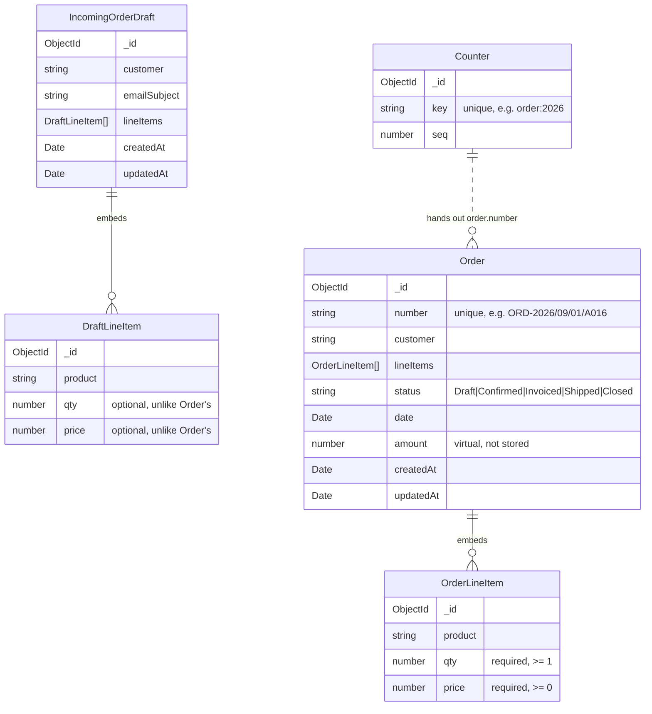

# FlowERP — Master Database Architecture & System-Wide ERD

> **Scope:** Consolidated system-wide Entity-Relationship Diagram (ERD) and technical schema specifications for all 12 MongoDB/Mongoose models (13 collections) across FlowERP. All models automatically include `_id: ObjectId` and `{ timestamps: true }` (`createdAt`, `updatedAt`) unless noted otherwise.

---

## 1. System-Wide Entity-Relationship Diagram (ERD)


---

## 2. Relationships & Reference Matrix

| Source Entity | Target Entity | Relationship Type | Key / Mechanism | Behavior & Notes |
|---|---|---|---|---|
| `Order` | `OrderLineItem` | **1 : N (Embedded)** | Embedded subdocuments array | Line items have no independent existence; validated with at least 1 item. |
| `IncomingOrderDraft` | `DraftLineItem` | **1 : N (Embedded)** | Embedded subdocuments array | Permissive schema for unverified inbound email parsing. |
| `Invoice` | `Order` | **N : 1 (Reference)** | `orderId: ObjectId` (`ref: "Order"`) | Hydrated on read via Mongoose `.populate("orderId")`. |
| `Shipment` | `Order` | **N : 1 (Reference)** | `orderId: ObjectId` (`ref: "Order"`) | Associates freight manifests with the source sales order. |
| `Shipment` | `Invoice` | **N : 1 (Reference)** | `invoiceId: ObjectId` (`ref: "Invoice"`) | Optional reference (`default: null`); tracks commercial invoice pairing. |
| `ProductionJob` | `Order` | **N : 1 (Business Link)** | `orderNumber: String` | String reference supporting Make-to-Order traceability from shop floor to order. |
| `Product` | `InventoryItem` | **1 : 1 (Business Link)** | `sku: String` | Matches catalog product with warehouse physical bin stock. |
| `Counter` | `Order`, `Invoice`, `Shipment`, `Job` | **1 : N (Sequence Generator)** | `key: String` (e.g. `"order:2026"`) | Atomic `$inc` via `findOneAndUpdate` ensuring gapless, collision-free numbers. |

---

## 3. Schema Specifications by Domain

### 3.1 Auth & Access Control
* **`User`** (`server/src/models/User.ts`):
  | Field | Type | Rules & Constraints |
  |---|---|---|
  | `username` | `String` | Required, unique, trimmed, lowercase, minlength: 3. |
  | `passwordHash` | `String` | Required, `select: false` (hidden from default queries). |
  | `role` | `String` | Enum: `["admin", "staff"]`, default: `"staff"`. |

---

### 3.2 Master Data & Warehouse
* **`Product`** (`server/src/models/Product.ts`):
  | Field | Type | Rules & Constraints |
  |---|---|---|
  | `sku` | `String` | Required, unique, trimmed, uppercase (e.g. `"CHAIR-001"`). |
  | `name` | `String` | Required, trimmed commercial item name. |
  | `category` | `String` | Trimmed category grouping (`Seating`, `Storage`, `Desks`, `Tables`). |
  | `price` | `Number` | Required, `min: 0` (USD unit selling price). |

* **`InventoryItem`** (`server/src/models/InventoryItem.ts`):
  | Field | Type | Rules & Constraints |
  |---|---|---|
  | `sku` | `String` | Required, unique; corresponds to `Product.sku`. |
  | `name` | `String` | Required inventory item name. |
  | `category` | `String` | Optional category classification. |
  | `qty` | `Number` | Required, `min: 0` (current physical stock count). |
  | `reorderPoint` | `Number` | Required, `min: 0` (threshold flagging low stock). |

* **`Customer`** (`server/src/models/Customer.ts`):
  | Field | Type | Rules & Constraints |
  |---|---|---|
  | `name` | `String` | Required, trimmed company or individual name. |
  | `contact` | `String` | Trimmed primary contact person. |
  | `email` | `String` | Trimmed email address. |
  | `city` | `String` | Trimmed location city. |

* **`Supplier`** (`server/src/models/Supplier.ts`):
  | Field | Type | Rules & Constraints |
  |---|---|---|
  | `name` | `String` | Required, trimmed vendor business name. |
  | `category` | `String` | Trimmed supply category (`Hardware`, `Wood`, `Textiles`). |
  | `contact` | `String` | Trimmed phone / email contact. |
  | `leadTime` | `String` | Trimmed standard delivery lead time (e.g. `"2 weeks"`). |

---

### 3.3 Sales Pipeline & Order Intake
* **`Order`** (`server/src/models/Order.ts`):
  | Field | Type | Rules & Constraints |
  |---|---|---|
  | `number` | `String` | Required, unique, immutable display ID (`ORD-YYYY/MM/DD/AXXX`). |
  | `customer` | `String` | Trimmed customer name. |
  | `lineItems` | `[OrderLineItem]` | Embedded array; custom validator requires at least 1 item. |
  | `status` | `String` | Enum: `["Draft", "Confirmed", "Invoiced", "Shipped", "Closed"]`, default: `"Draft"`. |
  | `date` | `Date` | Required order placement date. |
  | `amount` | `Number` *(virtual)* | Computed on read via `Σ (qty × price)`. Not stored in DB. |

  * **`OrderLineItem`** (Embedded): `product` (string, trimmed), `qty` (number, required, min: 1), `price` (number, required, min: 0).

* **`IncomingOrderDraft`** (`server/src/models/IncomingOrderDraft.ts`):
  | Field | Type | Rules & Constraints |
  |---|---|---|
  | `customer` | `String` | Trimmed candidate customer name. |
  | `emailSubject` | `String` | Trimmed inbound email subject line. |
  | `lineItems` | `[DraftLineItem]` | Embedded array of candidate lines (fields optional during review). |

---

### 3.4 Operations & Manufacturing
* **`Invoice`** (`server/src/models/Invoice.ts`):
  | Field | Type | Rules & Constraints |
  |---|---|---|
  | `number` | `String` | Required, unique display ID (`INV-YYYY/MM/DD/AXXX`). |
  | `orderId` | `ObjectId` | Required foreign reference (`ref: "Order"`). |
  | `status` | `String` | Enum: `["Draft", "Sent", "Paid", "Overdue"]`, default: `"Draft"`. |
  | `issueDate` | `Date` | Optional invoice billing date. |
  | `dueDate` | `Date` | Optional invoice payment due date. |

* **`Shipment`** (`server/src/models/Shipment.ts`):
  | Field | Type | Rules & Constraints |
  |---|---|---|
  | `number` | `String` | Required, unique display ID (`SHP-YYYY/MM/DD/AXXX`). |
  | `orderId` | `ObjectId` | Required foreign reference (`ref: "Order"`). |
  | `invoiceId` | `ObjectId` | Optional foreign reference (`ref: "Invoice"`, default: null). |
  | `status` | `String` | Enum: `["Draft", "Packed", "Dispatched", "Delivered"]`, default: `"Draft"`. |
  | `date` | `Date` | Optional dispatch/delivery date. |

* **`ProductionJob`** (`server/src/models/ProductionJob.ts`):
  | Field | Type | Rules & Constraints |
  |---|---|---|
  | `number` | `String` | Required, unique display ID (`JOB-YYYY/MM/DD/AXXX`). |
  | `orderNumber` | `String` | Optional Make-to-Order link to `Order.number`. |
  | `customer` | `String` | Optional destination customer name. |
  | `product` | `String` | Required manufactured product name. |
  | `qty` | `Number` | Required, `min: 1` units to produce. |
  | `due` | `Date` | Required manufacturing due date. |
  | `status` | `String` | Enum: `["Planned", "In Progress", "Completed"]`, default: `"Planned"`. |
  | `progress` | `Number` | `min: 0`, `max: 100`, default: `0` (percentage complete). |

---

### 3.5 Atomic Numbering & Dashboard Analytics
* **`Counter`** (`server/src/models/Counter.ts`):
  | Field | Type | Rules & Constraints |
  |---|---|---|
  | `key` | `String` | Required, unique partition key (e.g. `"order:2026"`, `"invoice:2026"`). |
  | `seq` | `Number` | Default: `0`; incremented atomically via `$inc` in `findOneAndUpdate`. |

* **`ActivityFeedEntry`** (`server/src/models/Dashboard.ts`):
  | Field | Type | Rules & Constraints |
  |---|---|---|
  | `message` | `String` | Required audit message (e.g. `"ORD-1041 moved to Invoiced"`). |
  | `occurredAt` | `Date` | Default: `Date.now`. |

* **`RevenueSeriesPoint`** (`server/src/models/Dashboard.ts`):
  | Field | Type | Rules & Constraints |
  |---|---|---|
  | `week` | `String` | Required weekly bucket identifier (e.g. `"W1"` through `"W8"`). |
  | `revenue` | `Number` | Required gross revenue amount in USD. |
  | `orders` | `Number` | Required order count for that week. |
  | `sortOrder` | `Number` | Required integer (1–8) for chronological graph display. |

---

## 4. Indexing & Query Optimization Strategy

| Collection | Indexed Field(s) | Type | Rationale |
|---|---|---|---|
| `users` | `username: 1` | Unique | Enforces unique usernames and optimizes login authentication. |
| `products` | `sku: 1` | Unique | Enforces catalog item uniqueness across the platform. |
| `inventoryitems` | `sku: 1` | Unique | Fast warehouse lookups and 1:1 sync with `Product.sku`. |
| `orders` | `number: 1` | Unique | Fast lookup and duplicate prevention for business order IDs. |
| `invoices` | `number: 1` | Unique | Prevents duplicate invoice issuance numbers. |
| `invoices` | `orderId: 1` | Foreign Key | Accelerates `.populate("orderId")` relational lookups. |
| `shipments` | `number: 1` | Unique | Prevents duplicate freight manifest numbers. |
| `shipments` | `orderId: 1` | Foreign Key | Fast lookups for order delivery status. |
| `productionjobs`| `number: 1` | Unique | Guarantees unique job tracking IDs on the shop floor. |
| `counters` | `key: 1` | Unique | Required for atomic upsert increments in `findOneAndUpdate`. |
# Schema Diagram — Order, IncomingOrderDraft & Counter

> **Scope:** the three MongoDB/Mongoose schemas behind the Sales & Orders
> module: [`Order.ts`](../server/src/models/Order.ts),
> [`IncomingOrderDraft.ts`](../server/src/models/IncomingOrderDraft.ts), and
> [`Counter.ts`](../server/src/models/Counter.ts). See
> [`srcdesign.md`](./srcdesign.md) for the REST conventions these schemas'
> endpoints follow, and `CLAUDE.md` for how the rest of the backend fits
> together.

## 1. How the three schemas relate



**The lifecycle these three schemas exist to support:**

1. An inbound customer email is parsed (or entered by hand) into an
   **`IncomingOrderDraft`** — a holding area for something that *isn't a
   real order yet*, so a staff member can review/correct it first.
2. When approved (`POST /api/order-drafts/:id/approve`), the draft's line
   items are copied 1:1 into a brand-new **`Order`** (status `"Confirmed"`,
   since a human just reviewed it), the draft is deleted, and the order
   gets a human-readable `number`.
3. That `number` comes from **`Counter`** — a single shared atomic counter
   collection every record-numbered entity in the app draws from (Orders,
   Invoices, Shipments, Production Jobs each get their own prefix/sequence;
   this doc covers Order's use of it). See §4.

## 2. `Order`

| Field | Type | Notes |
|---|---|---|
| `number` | `String` | Required, **unique**. Human-readable id, e.g. `ORD-2026/09/01/A016` — see §4. Assigned once at creation; `order.controller.ts`'s `updateOrder` strips it from `PUT` bodies even if a client sends one, so it can never be overwritten after the fact. |
| `customer` | `String` | Trimmed. |
| `lineItems` | `[OrderLineItem]` | **Embedded** sub-documents (see §2.1) — not a separate collection. Custom validator rejects an empty array: *"An order must have at least one line item."* |
| `status` | `String` | Enum: `Draft`, `Confirmed`, `Invoiced`, `Shipped`, `Closed`. Defaults to `Draft`. Changed only through `PATCH /api/orders/:id/status` (the Kanban drag endpoint) in normal use, though `PUT` can also carry a status change. |
| `date` | `Date` | Required. |
| `amount` | `Number` (virtual) | **Not stored** — computed on read as `Σ(qty × price)` across `lineItems` (`orderSchema.virtual("amount")`). Can never drift out of sync with a line item edit, because there's nothing to keep in sync: it's recalculated every time the document is serialized. Only appears in JSON output because the schema sets `toJSON: { virtuals: true }` / `toObject: { virtuals: true }` — without that option a virtual is silently dropped from `res.json()`. |
| `createdAt` / `updatedAt` | `Date` | From `{ timestamps: true }`. |

### 2.1 `OrderLineItem` (embedded sub-schema)

| Field | Type | Notes |
|---|---|---|
| `product` | `String` | Trimmed. |
| `qty` | `Number` | **Required**, `min: 1` — a line with zero or negative quantity is never valid. |
| `price` | `Number` | **Required**, `min: 0` — free (0) is allowed, negative is not. |

Embedded rather than referenced, because a line item has no independent
existence: it can't be fetched, updated, or deleted except through its
parent `Order`. Mongoose gives each sub-document its own `_id`
automatically, which is what lets the UI target one specific line item
inside `lineItems` if it ever needs to (e.g. removing a single row from an
order being edited).

## 3. `IncomingOrderDraft`

| Field | Type | Notes |
|---|---|---|
| `customer` | `String` | Trimmed. |
| `emailSubject` | `String` | Trimmed. The subject line of the inbound email this draft was parsed from. |
| `lineItems` | `[DraftLineItem]` | Embedded, same rationale as `Order.lineItems`. |
| `createdAt` / `updatedAt` | `Date` | From `{ timestamps: true }`. |

Notably, `IncomingOrderDraft` has **no `status` and no `number`** — it
isn't a business record yet, so neither applies. It also has no `date`;
`Order.date` is set fresh at approval time (`new Date()` in
`orderDraft.controller.ts`'s `approveDraft`), not carried over from the
draft.

### 3.1 `DraftLineItem` (embedded sub-schema)

| Field | Type | Notes |
|---|---|---|
| `product` | `String` | Trimmed. |
| `qty` | `Number` | `min: 1` — **not required**, unlike `OrderLineItem.qty`. A draft is allowed to have an incomplete/unparsed line while a human is still reviewing it; an `Order` is not. |
| `price` | `Number` | `min: 0` — **not required**, same reasoning. |

This is the one deliberate structural difference between the two line-item
sub-schemas: `Order`'s line items must always be complete and valid, since
an order is a committed business record, while a draft's may still be
mid-review.

## 4. `Counter` & human-readable record numbers


| Field | Type | Notes |
|---|---|---|
| `key` | `String` | Required, **unique**. One document per (record type, year) — e.g. `"order:2026"`, `"invoice:2026"`. |
| `seq` | `Number` | Defaults to `0`; incremented atomically per call. |

`nextSequence(type, year)` (in `Counter.ts`) is the only thing that ever
touches this collection, via a single
`findOneAndUpdate({ key }, { $inc: { seq: 1 } }, { upsert: true, new: true })`
— the standard Mongoose atomic-counter pattern. The increment happens
**in one operation on the database itself**, not as a
read-then-write-in-application-code sequence, which is what makes it safe
under concurrency: MongoDB serializes concurrent `findOneAndUpdate` calls
against the same document, so two Orders created in the same instant still
get two different, gapless sequence numbers. This was verified directly —
see the "Verify end-to-end database persistence" section of the Sales &
Order Pipeline Persistence work: 8 orders created concurrently all came
back with distinct, sequential numbers (`A017`–`A024`), no duplicates or
gaps.

`formatRecordNumber` (in [`recordNumber.ts`](../server/src/utils/recordNumber.ts))
turns a raw `seq` into the display string:

```
ORD-2026/09/01/A017
└┬┘ └──┬──┘ └┬┘
 │      │     └─ letter block (A001-A999, then B001, C001, ...) — see below
 │      └─────── the date the record was created (not the counter's reset date)
 └────────────── type prefix: ORD / INV / SHP / JOB
```

The letter block exists because the sequence resets **once a year**, not
once a day — `key` is `"order:2026"`, not `"order:2026-09-01"` — so a
plain 3-digit number would only allow 999 orders across an entire
calendar year. Spending one letter buys another 999 (`A001`–`A999`, then
`B001`–`B999`, …), which comfortably covers far more volume than a bare
number ever could, at the cost of one extra character.

The prefix exists so two otherwise-identical-looking numbers stay
distinguishable — an `Order` and an `Invoice` created on the same day both
start their own sequence at `A001`; without the prefix there would be no
way to tell `2026/09/01/A001` the order apart from `2026/09/01/A001` the
invoice just by looking at it.

## 5. Verified behaviour (not just the schema on paper)

The following was exercised directly against the real MongoDB Atlas
cluster while writing this doc, not just inferred from the code:

- Creating an `Order` without `lineItems` → `400`, with the exact
  validation message above.
- Creating a valid multi-line-item `Order` → `amount` virtual computed
  correctly (`Σ qty×price`), `number` assigned in the expected format.
- `PATCH /api/orders/:id/status` with an invalid status string → `400`,
  order unchanged.
- `PUT /api/orders/:id` with a client-supplied `number` in the body → the
  server-assigned `number` is kept; the client's value is silently
  ignored, never applied.
- 8 orders created concurrently (`Promise`-style parallel requests) → 8
  unique, sequential `number`s, confirming `Counter`'s atomicity under
  real concurrency rather than just reading the code and assuming it's
  race-free.
- Full draft lifecycle: create → edit (`PUT`, changing a line item's
  `qty`) → approve (`POST .../approve`) → the resulting `Order` reflects
  the *edited* quantity (proving `approveDraft` reads the draft fresh from
  the database rather than trusting a stale value), the draft is deleted
  (`GET` on it afterward → `404`), and the new `Order` starts life as
  `status: "Confirmed"`.
