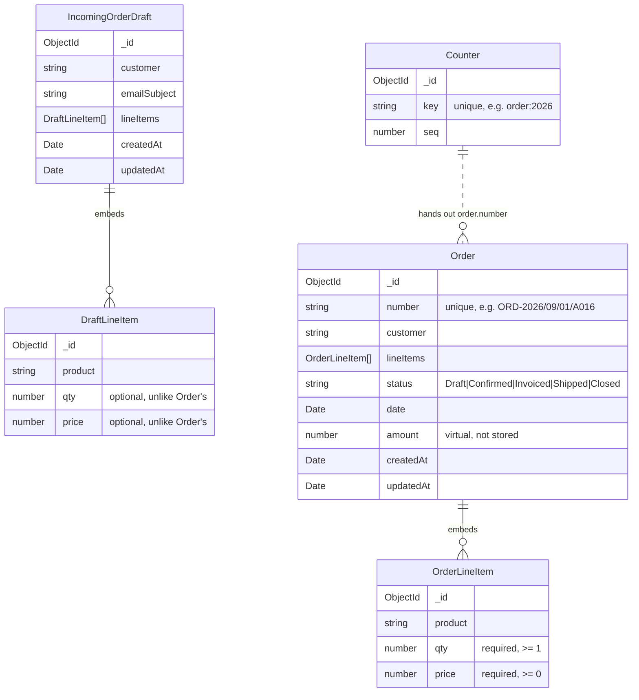

# Schema Diagram — Order, IncomingOrderDraft & Counter

> **Scope:** the three MongoDB/Mongoose schemas behind the Sales & Orders
> module: [`Order.ts`](../server/src/models/Order.ts),
> [`IncomingOrderDraft.ts`](../server/src/models/IncomingOrderDraft.ts), and
> [`Counter.ts`](../server/src/models/Counter.ts). See
> [`srcdesign.md`](./srcdesign.md) for the REST conventions these schemas'
> endpoints follow, and `CLAUDE.md` for how the rest of the backend fits
> together.

## 1. How the three schemas relate



**The lifecycle these three schemas exist to support:**

1. An inbound customer email is parsed (or entered by hand) into an
   **`IncomingOrderDraft`** — a holding area for something that *isn't a
   real order yet*, so a staff member can review/correct it first.
2. When approved (`POST /api/order-drafts/:id/approve`), the draft's line
   items are copied 1:1 into a brand-new **`Order`** (status `"Confirmed"`,
   since a human just reviewed it), the draft is deleted, and the order
   gets a human-readable `number`.
3. That `number` comes from **`Counter`** — a single shared atomic counter
   collection every record-numbered entity in the app draws from (Orders,
   Invoices, Shipments, Production Jobs each get their own prefix/sequence;
   this doc covers Order's use of it). See §4.

## 2. `Order`

| Field | Type | Notes |
|---|---|---|
| `number` | `String` | Required, **unique**. Human-readable id, e.g. `ORD-2026/09/01/A016` — see §4. Assigned once at creation; `order.controller.ts`'s `updateOrder` strips it from `PUT` bodies even if a client sends one, so it can never be overwritten after the fact. |
| `customer` | `String` | Trimmed. |
| `lineItems` | `[OrderLineItem]` | **Embedded** sub-documents (see §2.1) — not a separate collection. Custom validator rejects an empty array: *"An order must have at least one line item."* |
| `status` | `String` | Enum: `Draft`, `Confirmed`, `Invoiced`, `Shipped`, `Closed`. Defaults to `Draft`. Changed only through `PATCH /api/orders/:id/status` (the Kanban drag endpoint) in normal use, though `PUT` can also carry a status change. |
| `date` | `Date` | Required. |
| `amount` | `Number` (virtual) | **Not stored** — computed on read as `Σ(qty × price)` across `lineItems` (`orderSchema.virtual("amount")`). Can never drift out of sync with a line item edit, because there's nothing to keep in sync: it's recalculated every time the document is serialized. Only appears in JSON output because the schema sets `toJSON: { virtuals: true }` / `toObject: { virtuals: true }` — without that option a virtual is silently dropped from `res.json()`. |
| `createdAt` / `updatedAt` | `Date` | From `{ timestamps: true }`. |

### 2.1 `OrderLineItem` (embedded sub-schema)

| Field | Type | Notes |
|---|---|---|
| `product` | `String` | Trimmed. |
| `qty` | `Number` | **Required**, `min: 1` — a line with zero or negative quantity is never valid. |
| `price` | `Number` | **Required**, `min: 0` — free (0) is allowed, negative is not. |

Embedded rather than referenced, because a line item has no independent
existence: it can't be fetched, updated, or deleted except through its
parent `Order`. Mongoose gives each sub-document its own `_id`
automatically, which is what lets the UI target one specific line item
inside `lineItems` if it ever needs to (e.g. removing a single row from an
order being edited).

## 3. `IncomingOrderDraft`

| Field | Type | Notes |
|---|---|---|
| `customer` | `String` | Trimmed. |
| `emailSubject` | `String` | Trimmed. The subject line of the inbound email this draft was parsed from. |
| `lineItems` | `[DraftLineItem]` | Embedded, same rationale as `Order.lineItems`. |
| `createdAt` / `updatedAt` | `Date` | From `{ timestamps: true }`. |

Notably, `IncomingOrderDraft` has **no `status` and no `number`** — it
isn't a business record yet, so neither applies. It also has no `date`;
`Order.date` is set fresh at approval time (`new Date()` in
`orderDraft.controller.ts`'s `approveDraft`), not carried over from the
draft.

### 3.1 `DraftLineItem` (embedded sub-schema)

| Field | Type | Notes |
|---|---|---|
| `product` | `String` | Trimmed. |
| `qty` | `Number` | `min: 1` — **not required**, unlike `OrderLineItem.qty`. A draft is allowed to have an incomplete/unparsed line while a human is still reviewing it; an `Order` is not. |
| `price` | `Number` | `min: 0` — **not required**, same reasoning. |

This is the one deliberate structural difference between the two line-item
sub-schemas: `Order`'s line items must always be complete and valid, since
an order is a committed business record, while a draft's may still be
mid-review.

## 4. `Counter` & human-readable record numbers


| Field | Type | Notes |
|---|---|---|
| `key` | `String` | Required, **unique**. One document per (record type, year) — e.g. `"order:2026"`, `"invoice:2026"`. |
| `seq` | `Number` | Defaults to `0`; incremented atomically per call. |

`nextSequence(type, year)` (in `Counter.ts`) is the only thing that ever
touches this collection, via a single
`findOneAndUpdate({ key }, { $inc: { seq: 1 } }, { upsert: true, new: true })`
— the standard Mongoose atomic-counter pattern. The increment happens
**in one operation on the database itself**, not as a
read-then-write-in-application-code sequence, which is what makes it safe
under concurrency: MongoDB serializes concurrent `findOneAndUpdate` calls
against the same document, so two Orders created in the same instant still
get two different, gapless sequence numbers. This was verified directly —
see the "Verify end-to-end database persistence" section of the Sales &
Order Pipeline Persistence work: 8 orders created concurrently all came
back with distinct, sequential numbers (`A017`–`A024`), no duplicates or
gaps.

`formatRecordNumber` (in [`recordNumber.ts`](../server/src/utils/recordNumber.ts))
turns a raw `seq` into the display string:

```
ORD-2026/09/01/A017
└┬┘ └──┬──┘ └┬┘
 │      │     └─ letter block (A001-A999, then B001, C001, ...) — see below
 │      └─────── the date the record was created (not the counter's reset date)
 └────────────── type prefix: ORD / INV / SHP / JOB
```

The letter block exists because the sequence resets **once a year**, not
once a day — `key` is `"order:2026"`, not `"order:2026-09-01"` — so a
plain 3-digit number would only allow 999 orders across an entire
calendar year. Spending one letter buys another 999 (`A001`–`A999`, then
`B001`–`B999`, …), which comfortably covers far more volume than a bare
number ever could, at the cost of one extra character.

The prefix exists so two otherwise-identical-looking numbers stay
distinguishable — an `Order` and an `Invoice` created on the same day both
start their own sequence at `A001`; without the prefix there would be no
way to tell `2026/09/01/A001` the order apart from `2026/09/01/A001` the
invoice just by looking at it.

## 5. Verified behaviour (not just the schema on paper)

The following was exercised directly against the real MongoDB Atlas
cluster while writing this doc, not just inferred from the code:

- Creating an `Order` without `lineItems` → `400`, with the exact
  validation message above.
- Creating a valid multi-line-item `Order` → `amount` virtual computed
  correctly (`Σ qty×price`), `number` assigned in the expected format.
- `PATCH /api/orders/:id/status` with an invalid status string → `400`,
  order unchanged.
- `PUT /api/orders/:id` with a client-supplied `number` in the body → the
  server-assigned `number` is kept; the client's value is silently
  ignored, never applied.
- 8 orders created concurrently (`Promise`-style parallel requests) → 8
  unique, sequential `number`s, confirming `Counter`'s atomicity under
  real concurrency rather than just reading the code and assuming it's
  race-free.
- Full draft lifecycle: create → edit (`PUT`, changing a line item's
  `qty`) → approve (`POST .../approve`) → the resulting `Order` reflects
  the *edited* quantity (proving `approveDraft` reads the draft fresh from
  the database rather than trusting a stale value), the draft is deleted
  (`GET` on it afterward → `404`), and the new `Order` starts life as
  `status: "Confirmed"`.
