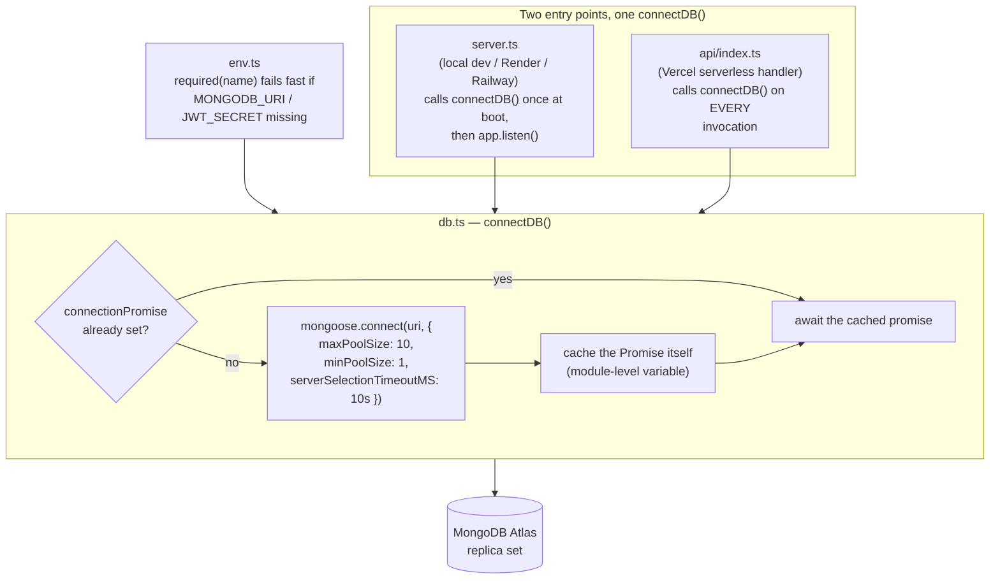
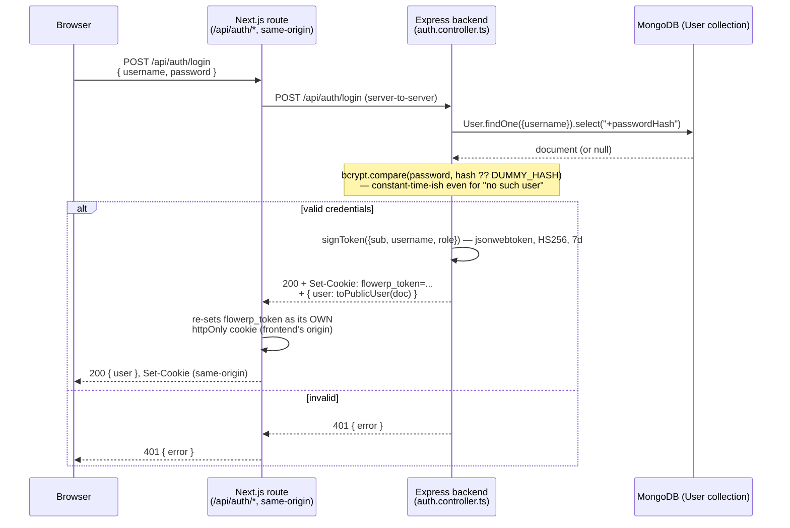
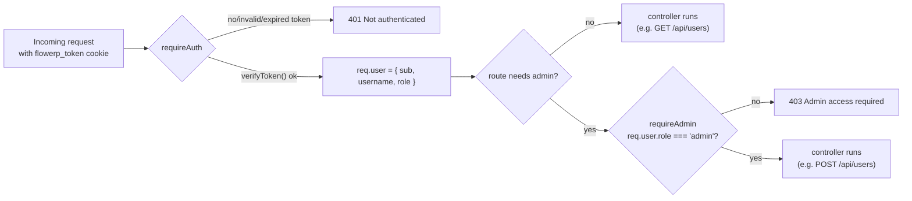

# FlowERP Backend — Connection & Auth Schema

Scope: the Express + Mongoose backend (`/server`). Covers how it connects to
MongoDB and how user identity/session data is shaped and secured. See the
root [`CLAUDE.md`](../CLAUDE.md) for the rest of the architecture (domain
layer, repositories, frontend routing) — this file only goes deep on the two
pieces called out for M3 sign-off: the core connection and the user security
schema.

## 1. Core Connection Architecture

**Files:** [`server/src/config/env.ts`](../server/src/config/env.ts),
[`server/src/config/db.ts`](../server/src/config/db.ts),
[`server/src/server.ts`](../server/src/server.ts) (long-running entry point),
[`server/api/index.ts`](../server/api/index.ts) (serverless entry point).

**Why the promise (not just a connection object) is cached:** a serverless
handler runs on every request, so `connectDB()` is called far more often
than once. Caching the `Promise<typeof mongoose>` — not only the resolved
connection — means a burst of concurrent requests arriving while the first
connection is still being established all await the *same* in-flight
connect, instead of racing to open several. A cold container opens one
connection; a warm container reuses it for free. Without this, a naive
"connect on every request" implementation would exhaust Atlas's connection
limit almost immediately under any real concurrency.

**Pool sizing rationale:** `maxPoolSize: 10` keeps any single warm container
well under Atlas's free/shared-tier connection ceiling even when several
containers are warm at once; `minPoolSize: 1` avoids paying a fresh-TCP+TLS
handshake on the first request after a quiet period.
`serverSelectionTimeoutMS: 10_000` turns a misconfigured/unreachable
`MONGODB_URI` into a clear timeout error within 10s instead of a request
that hangs indefinitely.

**Fail-fast env validation:** `env.ts` is the *only* file allowed to touch
`process.env` directly (see its own header comment) — every required
variable is read through `required(name)`, which throws immediately at
import time if it's missing. This means a missing `MONGODB_URI` or
`JWT_SECRET` crashes the process at startup with a message telling you to
copy `.env.example`, rather than surfacing as an opaque error the first time
a route handler happens to touch the database or sign a token.

## 2. User Security Schema

**Files:** [`server/src/models/User.ts`](../server/src/models/User.ts)
(schema), [`server/src/controllers/auth.controller.ts`](../server/src/controllers/auth.controller.ts)
(register/login/logout/me),
[`server/src/utils/passwordHasher.ts`](../server/src/utils/passwordHasher.ts)
(bcrypt), [`server/src/utils/jwt.ts`](../server/src/utils/jwt.ts) (sign/verify),
[`server/src/middleware/auth.ts`](../server/src/middleware/auth.ts)
(`requireAuth`, `requireAdmin`).

### 2.1 `User` collection schema

| Field | Type | Constraints |
|---|---|---|
| `_id` | ObjectId | default Mongo id (not a custom string id — see `CLAUDE.md` "Master data") |
| `username` | String | `required`, `unique`, `trim`, `lowercase`, `minlength: 3` |
| `passwordHash` | String | `required`, **`select: false`** — excluded from every query result unless a call explicitly opts in with `.select("+passwordHash")` |
| `role` | String enum | `"admin" \| "staff"`, `default: "staff"` |
| `createdAt` / `updatedAt` | Date | from `{ timestamps: true }` |

`select: false` is the schema-level guarantee that a password hash can never
leak through an ordinary `User.find()`/`findById()` — the *only* place in
the whole backend that adds `.select("+passwordHash")` is `login()`, right
where it's needed to compare a submitted password. Every response ever sent
to a client goes through `toPublicUser()`, which reads only
`{ id, username, role, createdAt }` off the document — structurally
incapable of including the hash, the same encapsulation pattern the
Next.js-side `User` domain class used before decommissioning (see §3).

### 2.2 Request → response flow

**Why the cookie gets re-set by the Next.js route instead of passed through
untouched:** the browser only ever talks to the frontend's own origin.
Setting a cookie on the *backend's* origin directly (a true cross-origin
`fetch`) is silently dropped by modern browsers' third-party-cookie
blocking regardless of `SameSite`/`Secure` configuration — see
[`src/app/api/[...path]/route.ts`](../src/app/api/%5B...path%5D/route.ts)'s
own comment for the full story. So every client-side call, auth included,
goes through a same-origin Next.js route that forwards to Express
server-to-server and re-issues the identical JWT as a same-origin cookie.
Both sides sign/verify with the same `JWT_SECRET` and the same
`flowerp_token` cookie name, so the token itself is unchanged — only which
origin's cookie jar holds it changes.

### 2.3 Authorization checks

`requireAuth` verifies the JWT's signature/expiry via `jsonwebtoken.verify`
against `env.jwtSecret` — it never touches MongoDB, so an authorization
check costs one HMAC verification, not a database round trip. `requireAdmin`
only ever runs after `requireAuth` and reads the role straight off the
already-verified token claims. Role changes therefore take effect on that
user's *next login*, not instantly — the trade-off documented for the
Next.js prototype's hand-rolled tokens in `CLAUDE.md` applies identically
here: no server-side session store means no way to revoke or upgrade a role
mid-session, acceptable for this project's scale.

### 2.4 Timing-safe login

`login()` always calls `bcrypt.compare()` — against the real hash if the
user exists, against a fixed dummy bcrypt hash (`DUMMY_HASH`) if they don't
— before ever returning 401. Skipping the compare on a missing user would
make "no such user" measurably faster than "wrong password," which is
enough of a timing signal to enumerate valid usernames; always paying the
bcrypt cost closes that gap.

## 3. Decommissioned: Next.js in-memory `UserRepository`

Earlier in this project, `src/repositories/UserRepository.ts` and
`src/repositories/user-seed-data.ts` held an in-memory, array-backed `User`
store used by the Next.js app's own prototype auth routes, built to
validate the auth *design* (session tokens, `canEdit`-style encapsulation,
route protection) ahead of the mandated Express/Mongoose backend existing.

That cutover is now complete: every Next.js auth/user route
(`/api/auth/login`, `/api/auth/register`, `/api/auth/logout`,
`/api/users`, `/api/users/[id]`, and the `settings/users` Server Component)
proxies to this Express backend server-to-server rather than reading its
own array, and the Next.js and Express sides share one JWT format (standard
3-part HS256, same `JWT_SECRET`, same `flowerp_token` cookie name) so a
token signed by either side verifies on the other. With nothing left
importing them, `UserRepository.ts`, `user-seed-data.ts`, and the Next.js
side's now-unused `PasswordHasher.ts` (bcrypt wrapper — password hashing
happens exclusively in MongoDB-land now, via
`server/src/utils/passwordHasher.ts`) were deleted. Auth and role checks
are 100% MongoDB-backed, per §2 above.
