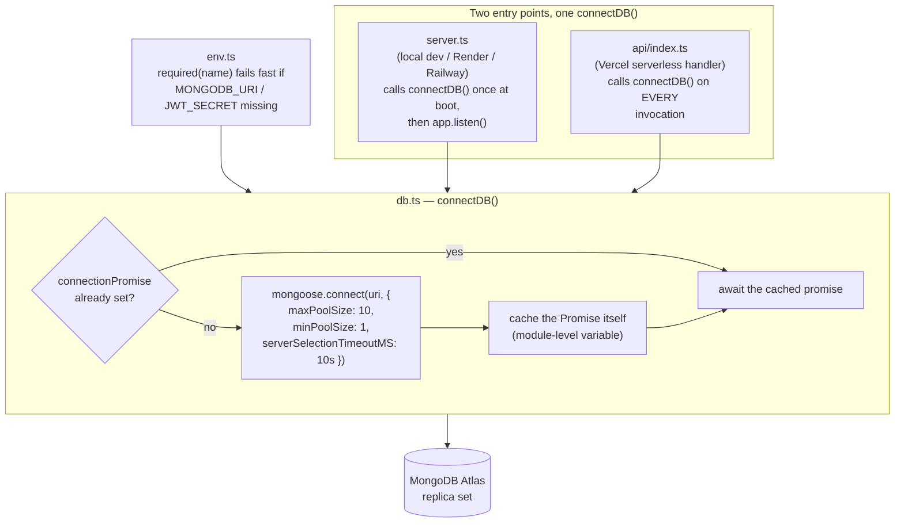
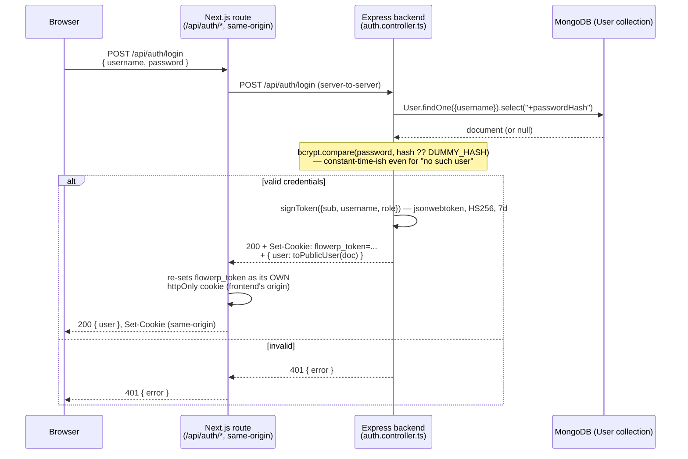
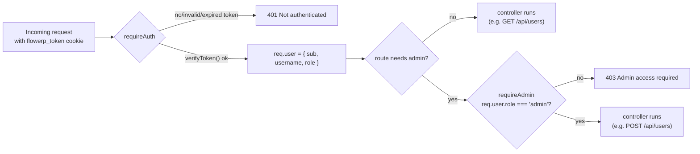
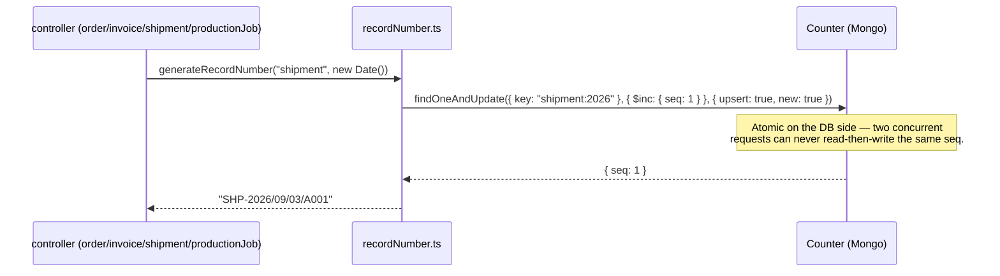

# FlowERP — Database Schema & Backend Architecture

> **Scope:** every MongoDB/Mongoose collection behind the Express backend
> (`/server`), how they relate, the connection layer that talks to Atlas,
> and the auth/session design built on top of it. This file was previously
> three separate, partially-overlapping documents pasted together across a
> few merges (a leftover duplicate title, a system-wide ERD, and a
> Sales/Logistics-specific ERD) — it has been consolidated into one,
> re-verified line-by-line against the current source rather than trusted
> from the prior versions. See root [`CLAUDE.md`](../CLAUDE.md) for the
> rest of the architecture (domain layer, repositories, frontend routing).
> All 13 collections below automatically get `_id: ObjectId` as their
> primary key; `createdAt`/`updatedAt` are called out per collection since
> three of them (`Counter`, `ActivityFeedEntry`, `RevenueSeriesPoint`)
> deliberately don't have `{ timestamps: true }`.

---

## 1. System-Wide Entity-Relationship Diagram

```mermaid
erDiagram
    %% ===== Auth =====
    User {
        ObjectId _id PK
        string username UK "lowercase, trimmed, min 3 chars"
        string passwordHash "select:false, never returned by default"
        string role "enum: admin, staff — default staff"
        date createdAt
        date updatedAt
    }

    %% ===== Master data =====
    Customer {
        ObjectId _id PK
        string name "required, trimmed"
        string contact
        string email
        string city
        date createdAt
        date updatedAt
    }

    Supplier {
        ObjectId _id PK
        string name "required, trimmed"
        string category
        string contact
        string leadTime
        date createdAt
        date updatedAt
    }

    Product {
        ObjectId _id PK
        string sku UK "required, uppercased, trimmed"
        string name "required, trimmed"
        string category
        number price "required, min 0"
        date createdAt
        date updatedAt
    }

    InventoryItem {
        ObjectId _id PK
        string sku UK "required"
        string name "required"
        string category
        number qty "required, min 0"
        number reorderPoint "required, min 0"
        date createdAt
        date updatedAt
    }

    %% ===== Sales pipeline =====
    Order {
        ObjectId _id PK
        string number UK "required, app-enforced immutable"
        string customer "free text, no FK"
        string status "enum: Draft,Confirmed,Invoiced,Shipped,Closed"
        date date "required"
        number amount "virtual, computed, not stored"
        date createdAt
        date updatedAt
    }

    OrderLineItem {
        ObjectId _id "auto, embedded sub-doc"
        string product
        number qty "required, min 1"
        number price "required, min 0"
    }

    IncomingOrderDraft {
        ObjectId _id PK
        string customer
        string emailSubject
        date createdAt
        date updatedAt
    }

    DraftLineItem {
        ObjectId _id "auto, embedded sub-doc"
        string product
        number qty "optional, min 1"
        number price "optional, min 0"
    }

    %% ===== Finance & logistics =====
    Invoice {
        ObjectId _id PK
        string number UK "required"
        ObjectId orderId FK "required, ref Order"
        string status "enum: Draft,Sent,Paid,Overdue"
        date issueDate
        date dueDate
        date createdAt
        date updatedAt
    }

    Shipment {
        ObjectId _id PK
        string number UK "required"
        ObjectId orderId FK "required, ref Order"
        ObjectId invoiceId FK "optional, ref Invoice, default null"
        string status "enum: Draft,Packed,Dispatched,Delivered"
        date date
        date createdAt
        date updatedAt
    }

    %% ===== Manufacturing =====
    ProductionJob {
        ObjectId _id PK
        string number UK "required"
        string orderNumber "optional, soft link to Order.number"
        string customer "optional, denormalized copy"
        string product "required"
        number qty "required, min 1"
        date due "required"
        string status "enum: Planned,In Progress,Completed"
        number progress "min 0, max 100, default 0"
        date createdAt
        date updatedAt
    }

    %% ===== Infrastructure =====
    Counter {
        ObjectId _id PK
        string key UK "required, e.g. order:2026"
        number seq "default 0"
    }

    %% ===== Dashboard analytics (standalone) =====
    ActivityFeedEntry {
        ObjectId _id PK
        string message "required"
        date occurredAt "default now"
    }

    RevenueSeriesPoint {
        ObjectId _id PK
        string week "required"
        number revenue "required"
        number orders "required"
        number sortOrder "required"
    }

    %% ===== Real ObjectId references (solid) =====
    Order ||--|{ OrderLineItem : "embeds (required, non-empty array)"
    IncomingOrderDraft ||--o{ DraftLineItem : "embeds (optional, may be empty)"
    Invoice }o--|| Order : "orderId (ref, required)"
    Shipment }o--|| Order : "orderId (ref, required)"
    Shipment }o--o| Invoice : "invoiceId (ref, optional/nullable)"

    %% ===== Denormalized / non-ref string matches (dotted, NOT real refs) =====
    Counter ||..o{ Order : "generates order.number via key \"order:YYYY\" — not an ObjectId ref"
    Counter ||..o{ Invoice : "generates invoice.number via key \"invoice:YYYY\" — not an ObjectId ref"
    Counter ||..o{ Shipment : "generates shipment.number via key \"shipment:YYYY\" — not an ObjectId ref"
    Counter ||..o{ ProductionJob : "generates job.number via key \"job:YYYY\" — not an ObjectId ref"
    ProductionJob }o..o| Order : "orderNumber string matches Order.number — soft link, actively matched by frontend fallback logic, no ObjectId ref"
    Product ||..o| InventoryItem : "sku string convention shared by both — no enforced FK, not joined anywhere in code (see §5)"
```

`Customer`, `Supplier`, and `User` are drawn with no relationship lines at
all — that's not an omission. Confirmed by grep across every controller
and page: `Order.customer` and `ProductionJob.customer` are free-text
strings with zero lookup against the `Customer` collection anywhere, and
no collection stores a `createdBy`/`userId` field pointing at `User`. See
§5 for the full discussion of what's deliberately unlinked vs. what looks
like it might be an accidental gap.

---

## 2. Relationship Reference Matrix

| Source | Target | Kind | Mechanism | Notes |
|---|---|---|---|---|
| `Order` | `OrderLineItem` | Embedded, 1:N | Sub-document array | Custom validator rejects an empty array. |
| `IncomingOrderDraft` | `DraftLineItem` | Embedded, 1:N | Sub-document array | No length validator — a draft can have zero line items; `POST /:id/approve` is what actually rejects an empty array, at conversion time. |
| `Invoice` | `Order` | Reference, N:1 | `orderId: ObjectId`, `ref: "Order"`, required | Populated via `.populate("orderId")` on `listInvoices` only — `getInvoice` does **not** populate it. |
| `Shipment` | `Order` | Reference, N:1 | `orderId: ObjectId`, `ref: "Order"`, required | Populated on every read (`list`, `get`, `create`, `update`, `dispatch`, `deliver`). |
| `Shipment` | `Invoice` | Reference, N:1 | `invoiceId: ObjectId`, `ref: "Invoice"`, optional (`default: null`) | Populated (`number` field only) alongside `orderId`. |
| `Counter` | `Order`, `Invoice`, `Shipment`, `ProductionJob` | Business link, not a ref | `key: String` (e.g. `"order:2026"`) read by `generateRecordNumber()` | Atomic `$inc` via `findOneAndUpdate`; no ObjectId anywhere in this relationship. |
| `ProductionJob` | `Order` | Soft/denormalized link, not a ref | `orderNumber: String` matched against `Order.number` | Actively matched — `production/page.tsx`'s `toProductionJob()` even has fallback logic matching by product name for older records missing `orderNumber`. Renaming an order's `number` would silently orphan the link; nothing cascades. |
| `Product` | `InventoryItem` | Naming convention only | Both use `sku` as their own unique key | **Not** enforced or joined by any code path — see the flag in §5. |

---

## 3. Field-by-field schema reference

### 3.1 Auth

**`User`** (`server/src/models/User.ts`)

| Field | Type | Notes |
|---|---|---|
| `username` | `String` | **Required, unique**, trimmed, lowercased, `minlength: 3`. |
| `passwordHash` | `String` | **Required**, `select: false` — excluded from every query unless `.select("+passwordHash")` is used explicitly (only `login()` does). |
| `role` | `String` | Enum: `admin`, `staff`. Default `"staff"`. |
| `createdAt` / `updatedAt` | `Date` | From `{ timestamps: true }`. |

### 3.2 Master data

**`Customer`** (`server/src/models/Customer.ts`)

| Field | Type | Notes |
|---|---|---|
| `name` | `String` | **Required**, trimmed. |
| `contact` | `String` | Optional, trimmed. |
| `email` | `String` | Optional, trimmed. No format validation. |
| `city` | `String` | Optional, trimmed. |
| `createdAt` / `updatedAt` | `Date` | From `{ timestamps: true }`. |

**`Supplier`** (`server/src/models/Supplier.ts`)

| Field | Type | Notes |
|---|---|---|
| `name` | `String` | **Required**, trimmed. |
| `category` | `String` | Optional, trimmed. |
| `contact` | `String` | Optional, trimmed. |
| `leadTime` | `String` | Optional, trimmed free text (e.g. `"2 weeks"`). |
| `createdAt` / `updatedAt` | `Date` | From `{ timestamps: true }`. |

**`Product`** (`server/src/models/Product.ts`)

| Field | Type | Notes |
|---|---|---|
| `sku` | `String` | **Required, unique**, trimmed, **uppercased automatically** by the schema. |
| `name` | `String` | **Required**, trimmed. |
| `category` | `String` | Optional, trimmed. |
| `price` | `Number` | **Required**, `min: 0`. |
| `createdAt` / `updatedAt` | `Date` | From `{ timestamps: true }`. |

**`InventoryItem`** (`server/src/models/InventoryItem.ts`)

| Field | Type | Notes |
|---|---|---|
| `sku` | `String` | **Required, unique**. No trim/uppercase transform, unlike `Product.sku` — see §5, this is one reason the two can drift apart (`"chr-001"` here vs `"CHR-001"` on `Product` would never collide as duplicates of each other). |
| `name` | `String` | **Required**. |
| `category` | `String` | Optional. |
| `qty` | `Number` | **Required**, `min: 0`. |
| `reorderPoint` | `Number` | **Required**, `min: 0`. |
| `createdAt` / `updatedAt` | `Date` | From `{ timestamps: true }`. |

### 3.3 Sales pipeline

**`Order`** (`server/src/models/Order.ts`)

| Field | Type | Notes |
|---|---|---|
| `number` | `String` | **Required, unique**. Assigned once via `generateRecordNumber("order", …)`; `updateOrder` strips any client-supplied `number` from `PUT` bodies, so it's immutable in practice — not a schema-level constraint. |
| `customer` | `String` | Trimmed. Free text — no reference to `Customer` anywhere in the code (see §5). |
| `lineItems` | `[OrderLineItem]` | Embedded array. Custom validator **rejects an empty array** ("An order must have at least one line item."). |
| `status` | `String` | Enum: `Draft`, `Confirmed`, `Invoiced`, `Shipped`, `Closed`. Default `"Draft"`. |
| `date` | `Date` | **Required**. |
| `amount` | `Number` (virtual) | **Not stored** — computed on read as `Σ(qty × price)` across `lineItems`, exposed via `toJSON`/`toObject` virtuals. |
| `createdAt` / `updatedAt` | `Date` | From `{ timestamps: true }`. |

**`OrderLineItem`** — embedded sub-schema, not its own collection.

| Field | Type | Notes |
|---|---|---|
| `product` | `String` | Trimmed. |
| `qty` | `Number` | **Required**, `min: 1`. |
| `price` | `Number` | **Required**, `min: 0`. |

**`IncomingOrderDraft`** (`server/src/models/IncomingOrderDraft.ts`)

| Field | Type | Notes |
|---|---|---|
| `customer` | `String` | Optional, trimmed. |
| `emailSubject` | `String` | Optional, trimmed — subject line of the parsed inbound email. |
| `lineItems` | `[DraftLineItem]` | Embedded array — **no non-empty validator**, unlike `Order.lineItems`. |
| `createdAt` / `updatedAt` | `Date` | From `{ timestamps: true }`. |

**`DraftLineItem`** — embedded sub-schema.

| Field | Type | Notes |
|---|---|---|
| `product` | `String` | Trimmed. |
| `qty` | `Number` | Optional, `min: 1` — **not required**, unlike `OrderLineItem.qty`. |
| `price` | `Number` | Optional, `min: 0` — **not required**. |

### 3.4 Finance & logistics

**`Invoice`** (`server/src/models/Invoice.ts`)

| Field | Type | Notes |
|---|---|---|
| `number` | `String` | **Required, unique**. |
| `orderId` | `ObjectId` | **Required**, `ref: "Order"`. |
| `status` | `String` | Enum: `Draft`, `Sent`, `Paid`, `Overdue`. Default `"Draft"`. |
| `issueDate` | `Date` | Optional. |
| `dueDate` | `Date` | Optional. |
| `createdAt` / `updatedAt` | `Date` | From `{ timestamps: true }`. |

**`Shipment`** (`server/src/models/Shipment.ts`)

| Field | Type | Notes |
|---|---|---|
| `number` | `String` | **Required, unique**. |
| `orderId` | `ObjectId` | **Required**, `ref: "Order"`. |
| `invoiceId` | `ObjectId` | Optional, `ref: "Invoice"`, `default: null`. |
| `status` | `String` | Enum: `Draft`, `Packed`, `Dispatched`, `Delivered`. Default `"Draft"`. |
| `date` | `Date` | Optional. |
| `createdAt` / `updatedAt` | `Date` | From `{ timestamps: true }`. |

### 3.5 Manufacturing

**`ProductionJob`** (`server/src/models/ProductionJob.ts`)

| Field | Type | Notes |
|---|---|---|
| `number` | `String` | **Required, unique**. |
| `orderNumber` | `String` | Optional. **Not a Mongo `ref`** — a soft string match against `Order.number`, resolved client-side. |
| `customer` | `String` | Optional. Denormalized copy of the linked order's `customer` string — itself free text, not a `Customer` reference. |
| `product` | `String` | **Required**. Free text — not validated against `Product.name` anywhere in the code (the earlier version of this doc claimed it "matches a `Product.name`"; that was never actually enforced). |
| `qty` | `Number` | **Required**, `min: 1`. |
| `due` | `Date` | **Required**. |
| `status` | `String` | Enum: `Planned`, `In Progress`, `Completed`. Default `"Planned"`. |
| `progress` | `Number` | `min: 0`, `max: 100`, default `0`. Only semantically meaningful while `status === "In Progress"`. |
| `createdAt` / `updatedAt` | `Date` | From `{ timestamps: true }`. |

### 3.6 Infrastructure

**`Counter`** (`server/src/models/Counter.ts`)

| Field | Type | Notes |
|---|---|---|
| `key` | `String` | **Required, unique**. One document per (record type, year) — e.g. `"order:2026"`, `"invoice:2026"`, `"shipment:2026"`, `"job:2026"`. |
| `seq` | `Number` | Default `0`; incremented atomically via `findOneAndUpdate({..}, {$inc:{seq:1}}, {upsert:true})`. |
| — | — | **No `{ timestamps: true }`** — this schema has neither `createdAt` nor `updatedAt`. (The previous version of this doc incorrectly listed both; corrected here.) |

### 3.7 Dashboard analytics

**`ActivityFeedEntry`** (`server/src/models/Dashboard.ts`)

| Field | Type | Notes |
|---|---|---|
| `message` | `String` | **Required**. |
| `occurredAt` | `Date` | Default `Date.now`. |
| — | — | **No `{ timestamps: true }`** on this schema either — no `createdAt`/`updatedAt`. |

**`RevenueSeriesPoint`** (`server/src/models/Dashboard.ts`)

| Field | Type | Notes |
|---|---|---|
| `week` | `String` | **Required**. |
| `revenue` | `Number` | **Required**. |
| `orders` | `Number` | **Required**. |
| `sortOrder` | `Number` | **Required**. |
| — | — | **No `{ timestamps: true }`**. |

---

## 4. What's deliberately unlinked

`Customer` and `Supplier` are never referenced by anything, by design —
`Order.customer` and `ProductionJob.customer` are plain free-text strings.
This matches the project's documented direction (`CLAUDE.md`, "Design
choices carried over from the domain layer"): the domain model treats
`Order.customer` as a string today on purpose, with a real foreign key
called out explicitly as a *future* tightening, not an oversight. `User`
is likewise fully decoupled from every business collection — nothing
stores a `createdBy`/`userId`, so authentication carries no weight over
what any given user has touched.

## 5. ⚠️ Flag before submission: `Product` vs. `InventoryItem`

`Product` and `InventoryItem` have near-identical shapes (`sku`, `name`,
`category` on both) but are two fully independent collections with **zero**
referential integrity between them, confirmed directly from
`product.controller.ts` and `inventory.controller.ts`:

- Creating a `Product` does not create a matching `InventoryItem`, and
  vice versa.
- Editing a `Product`'s `name`/`category` does not touch the corresponding
  `InventoryItem` row.
- `Product.sku` is trimmed and uppercased by the schema; `InventoryItem.sku`
  is not transformed at all — so the "same" SKU typed in lowercase on one
  side and uppercase on the other would be treated as two unrelated items
  by both collections' own uniqueness constraints, while looking identical
  to a person reading the UI.
- Nothing in either controller ever runs a `findOne` against the other
  collection — the "relationship" is a naming convention the team is
  trusting people to maintain by hand, not something the schema or API
  enforces.

This looks like the same real-world entity (a catalog item) modeled twice
for two different concerns (pricing/catalog vs. warehouse stock count)
without the join logic to keep them in sync. Worth a deliberate decision —
either give `InventoryItem` a real `productId: ObjectId` ref, or explicitly
document that the two are allowed to drift — before this goes into the
final submission, rather than leaving it looking like an oversight.

**Smaller note, same family of issue:** `Shipment.canEdit` in the Next.js
domain layer (`src/domain/Shipment.ts`) blocks editing once
`status === "Delivered"` — but that's a **frontend-only** check. The
backend's `PUT /api/shipments/:id` has no equivalent status guard, so a
direct API call (curl, Postman, or a bug in some other client) can still
modify a `Delivered` shipment. The previous version of this document
described this as the API "locking the shipment from further
modification," which overstated what's actually enforced server-side —
worth knowing before claiming this as tested backend behavior.

---

## 6. Core Connection Architecture

**Files:** [`server/src/config/env.ts`](../server/src/config/env.ts),
[`server/src/config/db.ts`](../server/src/config/db.ts),
[`server/src/server.ts`](../server/src/server.ts) (long-running entry point),
[`server/api/index.ts`](../server/api/index.ts) (serverless entry point).



**Why the promise (not just a connection object) is cached:** a serverless
handler runs on every request, so `connectDB()` is called far more often
than once. Caching the `Promise<typeof mongoose>` — not only the resolved
connection — means a burst of concurrent requests arriving while the first
connection is still being established all await the *same* in-flight
connect, instead of racing to open several. A cold container opens one
connection; a warm container reuses it for free.

**Pool sizing rationale:** `maxPoolSize: 10` keeps any single warm container
well under Atlas's free/shared-tier connection ceiling even when several
containers are warm at once; `minPoolSize: 1` avoids paying a fresh
TCP+TLS handshake on the first request after a quiet period.
`serverSelectionTimeoutMS: 10_000` turns a misconfigured/unreachable
`MONGODB_URI` into a clear timeout error within 10s instead of a request
that hangs indefinitely.

**Fail-fast env validation:** `env.ts` is the only file allowed to touch
`process.env` directly — every required variable is read through
`required(name)`, which throws immediately at import time if it's
missing, so a missing `MONGODB_URI`/`JWT_SECRET` crashes at startup with a
clear message rather than surfacing deep inside a request handler.

---

## 7. User Security Schema

**Files:** [`server/src/models/User.ts`](../server/src/models/User.ts)
(schema), [`server/src/controllers/auth.controller.ts`](../server/src/controllers/auth.controller.ts)
(register/login/logout/me),
[`server/src/utils/passwordHasher.ts`](../server/src/utils/passwordHasher.ts)
(bcrypt), [`server/src/utils/jwt.ts`](../server/src/utils/jwt.ts) (sign/verify),
[`server/src/middleware/auth.ts`](../server/src/middleware/auth.ts)
(`requireAuth`, `requireAdmin`). Field-by-field schema is in §3.1.

`select: false` on `passwordHash` is the schema-level guarantee that a
hash can never leak through an ordinary `User.find()`/`findById()` — the
only place in the whole backend that adds `.select("+passwordHash")` is
`login()`. Every response goes through `toPublicUser()`, which reads only
`{ id, username, role, createdAt }` — structurally incapable of including
the hash.

### 7.1 Request → response flow



The cookie gets re-set by the Next.js route rather than passed through
untouched because modern browsers block third-party cookies — a cookie
set by the backend's own domain while browsing the frontend's domain is
silently dropped, regardless of `SameSite`/`Secure`. See
[`src/app/api/[...path]/route.ts`](../src/app/api/%5B...path%5D/route.ts)'s
own comment for the full story. Both sides sign/verify with the same
`JWT_SECRET` and the same `flowerp_token` cookie name, so the token itself
is unchanged — only which origin's cookie jar holds it changes.

### 7.2 Authorization checks



`requireAuth` verifies the JWT's signature/expiry via `jsonwebtoken.verify`
— it never touches MongoDB, so an authorization check costs one HMAC
verification, not a database round trip. `requireAdmin` reads the role
straight off the already-verified token claims, so a role change takes
effect on that user's *next login*, not instantly — there's no
server-side session store to revoke or upgrade a role mid-session,
acceptable at this project's scale.

### 7.3 Timing-safe login

`login()` always calls `bcrypt.compare()` — against the real hash if the
user exists, against a fixed dummy bcrypt hash (`DUMMY_HASH`) if they
don't — before ever returning 401, so "no such user" and "wrong password"
take roughly the same time and can't be used to enumerate usernames.

---

## 8. Record numbering (`Counter`)



`formatRecordNumber` (in [`recordNumber.ts`](../server/src/utils/recordNumber.ts))
produces one structured identifier per type, all sharing the same
`Counter` collection but partitioned by `key` (`"order:2026"`,
`"invoice:2026"`, `"shipment:2026"`, `"job:2026"`):

```
SHP-2026/09/03/A001
└┬┘ └──┬──┘ └┬┘
 │      │     └─ letter block (A001-A999, then B001, C001, ...)
 │      └─────── date the record was created
 └────────────── type prefix: ORD / INV / SHP / JOB
```

---

## 9. Sales pipeline workflow

1. Inbound demand is parsed into an **`IncomingOrderDraft`** (`POST /api/order-drafts`).
2. `POST /api/order-drafts/:id/approve` is a **factory method**: it
   creates a new `Order` (`status: "Confirmed"`) carrying over the
   draft's `lineItems`, then deletes the draft. There is **no persistent
   link** between the two afterward — no ObjectId is stored anywhere
   connecting the resulting `Order` back to the draft it came from, so
   this conversion doesn't appear as an edge in §1's diagram (it's a
   one-time transformation, not an ongoing relationship).
3. An `Order` moves through `Draft → Confirmed → Invoiced → Shipped →
   Closed` via `PATCH /api/orders/:id/status`.
4. `Invoice` and `Shipment` documents reference the order via `orderId`;
   `Shipment.invoiceId` additionally links to the invoice once one exists
   (`null` until then).

**`Order` endpoints** (`server/src/routes/order.routes.ts`) — full CRUD
plus a status action: `GET /`, `GET /:id`, `POST /`, `PUT /:id`
(strips any client-supplied `number`), `DELETE /:id`, `PATCH /:id/status`.

**`Invoice` endpoints** (`server/src/routes/invoice.routes.ts`) — no
`DELETE`; an invoice moves through its lifecycle instead of being
removed: `GET /`, `GET /:id`, `POST /`, `PUT /:id`, `PATCH /:id/mark-paid`.

---

## 10. Shipment workflow

```
[ Draft ] ──(PUT)──> [ Packed ] ──(PATCH /dispatch)──> [ Dispatched ] ──(PATCH /deliver)──> [ Delivered ]
```

**Endpoints** (`server/src/routes/shipment.routes.ts`) — no `DELETE`:
`GET /`, `GET /:id`, `POST /`, `PUT /:id`, `PATCH /:id/dispatch`,
`PATCH /:id/deliver`. Every one of these populates both `orderId` and
`invoiceId` (`number` field only) before responding, via
`toPublicShipment()`'s `Document.populated()` check.

**Offline manifest caching** (frontend, `src/lib/offline.ts` +
`shipments/page.tsx`): successful `GET /api/shipments` responses are
snapshotted to `localStorage`. On a network drop, the UI falls back to
the cached snapshot and shows an offline banner; mutations while offline
fail with an error banner rather than silently queuing, since there's no
conflict-resolution story for edits made against a stale snapshot.

**Note on "Delivered" immutability** — see §5: this is enforced by the
frontend's `canEdit` getter only, not by the `PUT /api/shipments/:id`
endpoint itself.

---

## 11. ProductionJob workflow

### 11.1 Status state machine

```mermaid
stateDiagram-v2
    [*] --> Planned : Job created
    Planned --> "In Progress" : Work begins
    "In Progress" --> Completed : progress reaches 100% or manual move
    Planned --> Completed : Skip (direct completion)

    state Planned {
        [*] --> [*] : Editable — product, qty, due, orderNumber, customer (canEdit)
    }
    state "In Progress" {
        [*] --> [*] : Only progress (0-100%) editable (canEditProgress)
    }
    state Completed {
        [*] --> [*] : Read-only
    }
```

Enforced on the frontend by `src/domain/ProductionJob.ts`'s `canEdit`
(`status === "Planned"`) and `canEditProgress`
(`status === "In Progress"`) getters. The backend accepts status
transitions via `PATCH /api/production-jobs/:id/status`
(`{ status, progress? }`); the Mongoose enum validator rejects any string
outside the three allowed values with `400`, but — same caveat as
Shipment in §5 — the backend does not itself block a `PUT` to a
`Completed` job's scope fields; that's a frontend-only rule.

### 11.2 Order linkage (Make-to-Order)

`ProductionJob.orderNumber` stores the order's human-readable `number`
string, not its `_id` — a soft reference, not a Mongo `ref`. Rationale:
the production Kanban board displays the order number directly, so a
`populate()` round-trip would add latency for a string that's already
available at creation time. Trade-off: renaming or deleting an order
doesn't cascade to its production jobs, which the team considers
acceptable since a job represents physical work that can't be "undone" by
an order-side change. See §1's diagram and §2's matrix for how this is
represented.

**Endpoints** (`server/src/routes/productionJob.routes.ts`) — no
`DELETE`: `GET /`, `GET /:id`, `POST /`, `PUT /:id`,
`PATCH /:id/status`.

---

## 12. Decommissioned: Next.js in-memory `UserRepository`

Earlier in this project, `src/repositories/UserRepository.ts` and
`src/repositories/user-seed-data.ts` held an in-memory, array-backed
`User` store used by the Next.js app's own prototype auth routes, built
to validate the auth *design* (session tokens, `canEdit`-style
encapsulation, route protection) ahead of the mandated Express/Mongoose
backend existing.

That cutover is complete: every Next.js auth/user route
(`/api/auth/login`, `/api/auth/register`, `/api/auth/logout`,
`/api/users`, `/api/users/[id]`, and the `settings/users` Server
Component) proxies to the Express backend server-to-server rather than
reading its own array, and both sides share one JWT format (standard
3-part HS256, same `JWT_SECRET`, same `flowerp_token` cookie name) so a
token signed by either side verifies on the other. With nothing left
importing them, `UserRepository.ts`, `user-seed-data.ts`, and the
Next.js side's now-unused `PasswordHasher.ts` were deleted. Auth and role
checks are 100% MongoDB-backed, per §7.

---

## 13. Verified behaviour (end-to-end, against MongoDB Atlas)

- **Order**: missing `lineItems` → `400`; a valid multi-line order →
  `amount` virtual computed correctly and `number` assigned in the
  expected format; `PATCH /:id/status` with an invalid status string →
  `400`, order unchanged; a client-supplied `number` in a `PUT` body is
  silently ignored, server-assigned value kept; 8 orders created
  concurrently → 8 unique sequential numbers (real concurrency, not just
  read-and-assumed).
- **IncomingOrderDraft**: full lifecycle — create → edit (`PUT`, changing
  a line item's `qty`) → approve (`POST .../approve`) — the resulting
  `Order` reflects the *edited* quantity (proving `approveDraft` reads
  the draft fresh rather than trusting a stale value); the draft is
  deleted (`GET` on it afterward → `404`); the new `Order` starts as
  `status: "Confirmed"`.
- **Shipment**: missing/invalid `orderId` → `400` ("A valid orderId is
  required."); invalid `status` string → `400` with the allowed-values
  list; `GET /api/shipments`/`GET /:id` return populated `order` and
  `invoice` (or `null` when `invoiceId` is unset); `dispatch`/`deliver`
  atomically update status and return the populated document; concurrent
  shipment creation draws sequential, collision-free numbers.
- **Invoice**/**Customer**/**Supplier**/**Product**: full
  create → list → get → update round trips verified via curl against the
  live Atlas cluster, plus edge cases — missing required field → `400`,
  duplicate `Product.sku` → `409`, negative price → `400`, unauthenticated
  request → `401`, unknown id → `404`. All test-only documents were
  deleted afterward.
