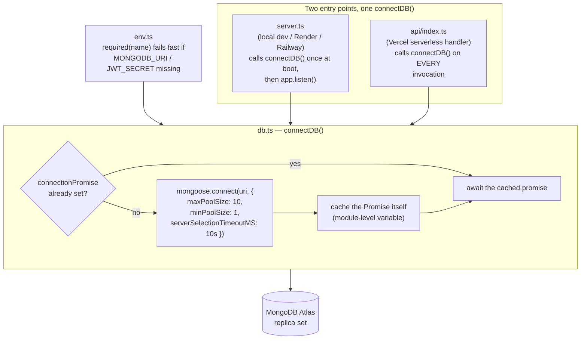
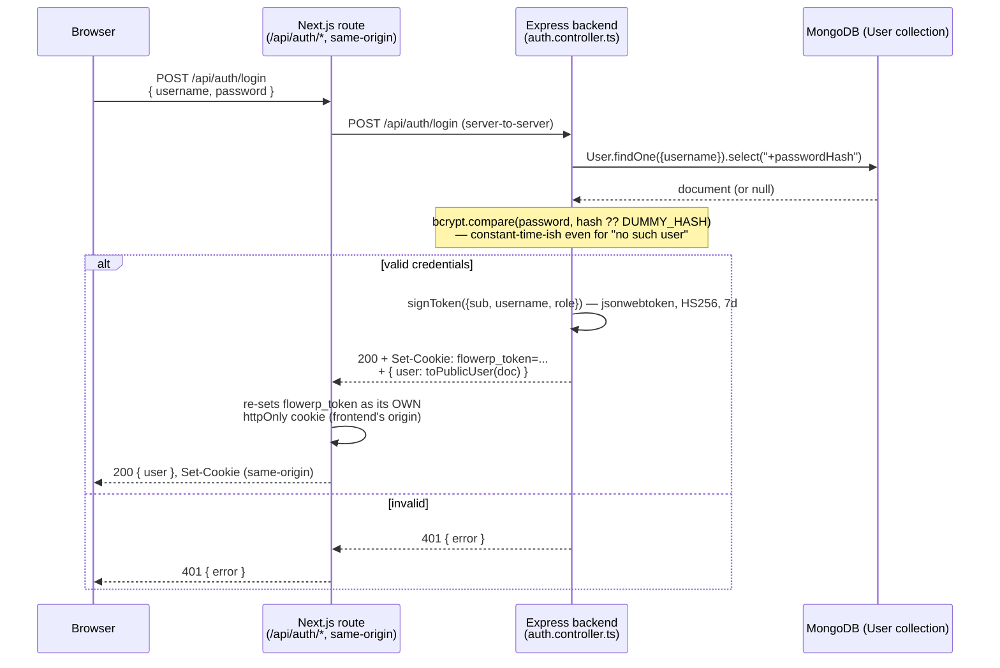
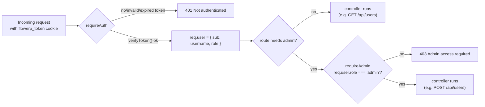
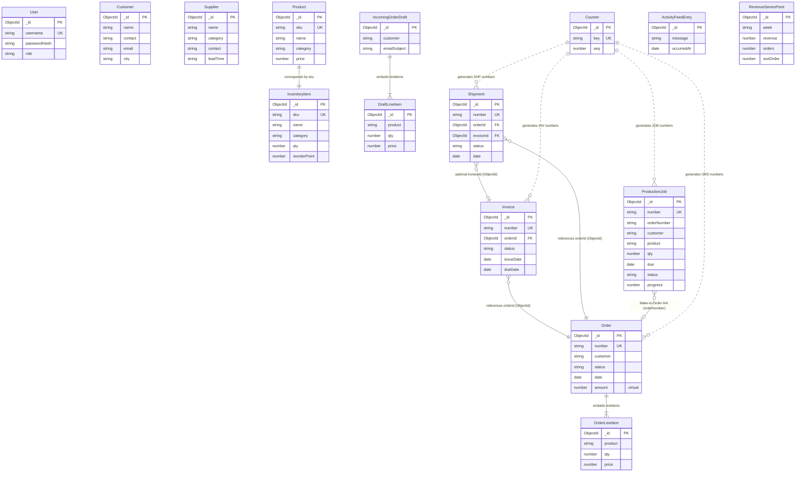
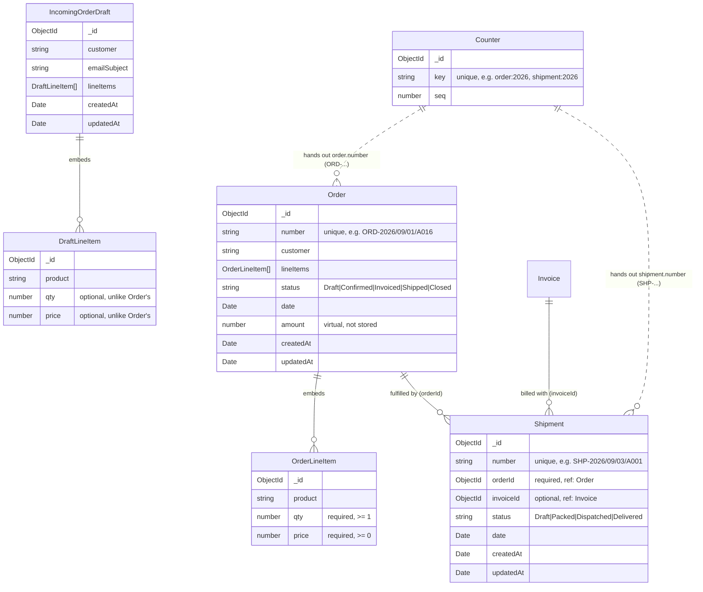
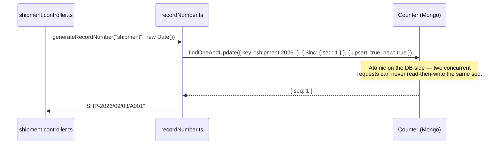
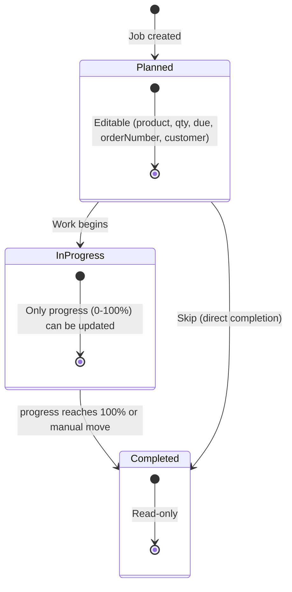
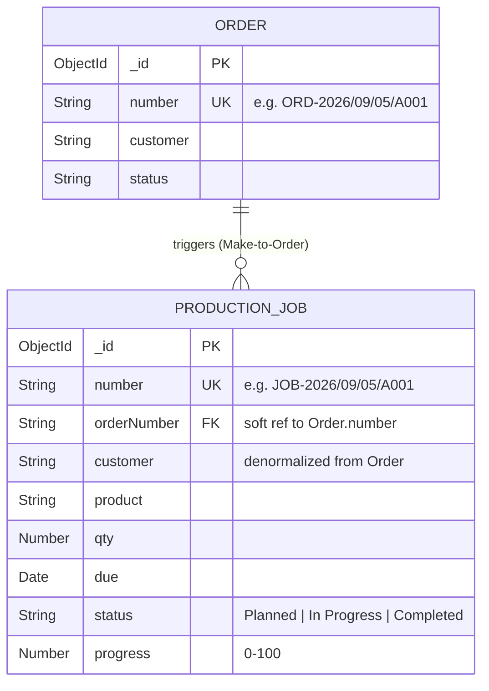

# Schema Diagram — Order, IncomingOrderDraft, Shipment & Counter
# FlowERP Backend — Connection & Auth Schema

Scope: the Express + Mongoose backend (`/server`). Covers how it connects to
MongoDB and how user identity/session data is shaped and secured. See the
root [`CLAUDE.md`](../CLAUDE.md) for the rest of the architecture (domain
layer, repositories, frontend routing) — this file only goes deep on the two
pieces called out for M3 sign-off: the core connection and the user security
schema.

## 1. Core Connection Architecture

**Files:** [`server/src/config/env.ts`](../server/src/config/env.ts),
[`server/src/config/db.ts`](../server/src/config/db.ts),
[`server/src/server.ts`](../server/src/server.ts) (long-running entry point),
[`server/api/index.ts`](../server/api/index.ts) (serverless entry point).



**Why the promise (not just a connection object) is cached:** a serverless
handler runs on every request, so `connectDB()` is called far more often
than once. Caching the `Promise<typeof mongoose>` — not only the resolved
connection — means a burst of concurrent requests arriving while the first
connection is still being established all await the *same* in-flight
connect, instead of racing to open several. A cold container opens one
connection; a warm container reuses it for free. Without this, a naive
"connect on every request" implementation would exhaust Atlas's connection
limit almost immediately under any real concurrency.

**Pool sizing rationale:** `maxPoolSize: 10` keeps any single warm container
well under Atlas's free/shared-tier connection ceiling even when several
containers are warm at once; `minPoolSize: 1` avoids paying a fresh-TCP+TLS
handshake on the first request after a quiet period.
`serverSelectionTimeoutMS: 10_000` turns a misconfigured/unreachable
`MONGODB_URI` into a clear timeout error within 10s instead of a request
that hangs indefinitely.

**Fail-fast env validation:** `env.ts` is the *only* file allowed to touch
`process.env` directly (see its own header comment) — every required
variable is read through `required(name)`, which throws immediately at
import time if it's missing. This means a missing `MONGODB_URI` or
`JWT_SECRET` crashes the process at startup with a message telling you to
copy `.env.example`, rather than surfacing as an opaque error the first time
a route handler happens to touch the database or sign a token.

## 2. User Security Schema

**Files:** [`server/src/models/User.ts`](../server/src/models/User.ts)
(schema), [`server/src/controllers/auth.controller.ts`](../server/src/controllers/auth.controller.ts)
(register/login/logout/me),
[`server/src/utils/passwordHasher.ts`](../server/src/utils/passwordHasher.ts)
(bcrypt), [`server/src/utils/jwt.ts`](../server/src/utils/jwt.ts) (sign/verify),
[`server/src/middleware/auth.ts`](../server/src/middleware/auth.ts)
(`requireAuth`, `requireAdmin`).

### 2.1 `User` collection schema

| Field | Type | Constraints |
|---|---|---|
| `_id` | ObjectId | default Mongo id (not a custom string id — see `CLAUDE.md` "Master data") |
| `username` | String | `required`, `unique`, `trim`, `lowercase`, `minlength: 3` |
| `passwordHash` | String | `required`, **`select: false`** — excluded from every query result unless a call explicitly opts in with `.select("+passwordHash")` |
| `role` | String enum | `"admin" \| "staff"`, `default: "staff"` |
| `createdAt` / `updatedAt` | Date | from `{ timestamps: true }` |

`select: false` is the schema-level guarantee that a password hash can never
leak through an ordinary `User.find()`/`findById()` — the *only* place in
the whole backend that adds `.select("+passwordHash")` is `login()`, right
where it's needed to compare a submitted password. Every response ever sent
to a client goes through `toPublicUser()`, which reads only
`{ id, username, role, createdAt }` off the document — structurally
incapable of including the hash, the same encapsulation pattern the
Next.js-side `User` domain class used before decommissioning (see §3).

### 2.2 Request → response flow



**Why the cookie gets re-set by the Next.js route instead of passed through
untouched:** the browser only ever talks to the frontend's own origin.
Setting a cookie on the *backend's* origin directly (a true cross-origin
`fetch`) is silently dropped by modern browsers' third-party-cookie
blocking regardless of `SameSite`/`Secure` configuration — see
[`src/app/api/[...path]/route.ts`](../src/app/api/%5B...path%5D/route.ts)'s
own comment for the full story. So every client-side call, auth included,
goes through a same-origin Next.js route that forwards to Express
server-to-server and re-issues the identical JWT as a same-origin cookie.
Both sides sign/verify with the same `JWT_SECRET` and the same
`flowerp_token` cookie name, so the token itself is unchanged — only which
origin's cookie jar holds it changes.

### 2.3 Authorization checks



`requireAuth` verifies the JWT's signature/expiry via `jsonwebtoken.verify`
against `env.jwtSecret` — it never touches MongoDB, so an authorization
check costs one HMAC verification, not a database round trip. `requireAdmin`
only ever runs after `requireAuth` and reads the role straight off the
already-verified token claims. Role changes therefore take effect on that
user's *next login*, not instantly — the trade-off documented for the
Next.js prototype's hand-rolled tokens in `CLAUDE.md` applies identically
here: no server-side session store means no way to revoke or upgrade a role
mid-session, acceptable for this project's scale.

### 2.4 Timing-safe login

`login()` always calls `bcrypt.compare()` — against the real hash if the
user exists, against a fixed dummy bcrypt hash (`DUMMY_HASH`) if they don't
— before ever returning 401. Skipping the compare on a missing user would
make "no such user" measurably faster than "wrong password," which is
enough of a timing signal to enumerate valid usernames; always paying the
bcrypt cost closes that gap.

## 3. Decommissioned: Next.js in-memory `UserRepository`

Earlier in this project, `src/repositories/UserRepository.ts` and
`src/repositories/user-seed-data.ts` held an in-memory, array-backed `User`
store used by the Next.js app's own prototype auth routes, built to
validate the auth *design* (session tokens, `canEdit`-style encapsulation,
route protection) ahead of the mandated Express/Mongoose backend existing.

That cutover is now complete: every Next.js auth/user route
(`/api/auth/login`, `/api/auth/register`, `/api/auth/logout`,
`/api/users`, `/api/users/[id]`, and the `settings/users` Server Component)
proxies to this Express backend server-to-server rather than reading its
own array, and the Next.js and Express sides share one JWT format (standard
3-part HS256, same `JWT_SECRET`, same `flowerp_token` cookie name) so a
token signed by either side verifies on the other. With nothing left
importing them, `UserRepository.ts`, `user-seed-data.ts`, and the Next.js
side's now-unused `PasswordHasher.ts` (bcrypt wrapper — password hashing
happens exclusively in MongoDB-land now, via
`server/src/utils/passwordHasher.ts`) were deleted. Auth and role checks
are 100% MongoDB-backed, per §2 above.
# FlowERP — Master Database Architecture & System-Wide ERD

> **Scope:** Consolidated system-wide Entity-Relationship Diagram (ERD) and technical schema specifications for all 12 MongoDB/Mongoose models (13 collections) across FlowERP. All models automatically include `_id: ObjectId` and `{ timestamps: true }` (`createdAt`, `updatedAt`) unless noted otherwise.

---

## 1. System-Wide Entity-Relationship Diagram (ERD)



---

## 2. Relationships & Reference Matrix

| Source Entity | Target Entity | Relationship Type | Key / Mechanism | Behavior & Notes |
|---|---|---|---|---|
| `Order` | `OrderLineItem` | **1 : N (Embedded)** | Embedded subdocuments array | Line items have no independent existence; validated with at least 1 item. |
| `IncomingOrderDraft` | `DraftLineItem` | **1 : N (Embedded)** | Embedded subdocuments array | Permissive schema for unverified inbound email parsing. |
| `Invoice` | `Order` | **N : 1 (Reference)** | `orderId: ObjectId` (`ref: "Order"`) | Hydrated on read via Mongoose `.populate("orderId")`. |
| `Shipment` | `Order` | **N : 1 (Reference)** | `orderId: ObjectId` (`ref: "Order"`) | Associates freight manifests with the source sales order. |
| `Shipment` | `Invoice` | **N : 1 (Reference)** | `invoiceId: ObjectId` (`ref: "Invoice"`) | Optional reference (`default: null`); tracks commercial invoice pairing. |
| `ProductionJob` | `Order` | **N : 1 (Business Link)** | `orderNumber: String` | String reference supporting Make-to-Order traceability from shop floor to order. |
| `Product` | `InventoryItem` | **1 : 1 (Business Link)** | `sku: String` | Matches catalog product with warehouse physical bin stock. |
| `Counter` | `Order`, `Invoice`, `Shipment`, `Job` | **1 : N (Sequence Generator)** | `key: String` (e.g. `"order:2026"`) | Atomic `$inc` via `findOneAndUpdate` ensuring gapless, collision-free numbers. |

---

## 3. Schema Specifications by Domain

### 3.1 Auth & Access Control
* **`User`** (`server/src/models/User.ts`):
  | Field | Type | Rules & Constraints |
  |---|---|---|
  | `username` | `String` | Required, unique, trimmed, lowercase, minlength: 3. |
  | `passwordHash` | `String` | Required, `select: false` (hidden from default queries). |
  | `role` | `String` | Enum: `["admin", "staff"]`, default: `"staff"`. |

---

### 3.2 Master Data & Warehouse
* **`Product`** (`server/src/models/Product.ts`):
  | Field | Type | Rules & Constraints |
  |---|---|---|
  | `sku` | `String` | Required, unique, trimmed, uppercase (e.g. `"CHAIR-001"`). |
  | `name` | `String` | Required, trimmed commercial item name. |
  | `category` | `String` | Trimmed category grouping (`Seating`, `Storage`, `Desks`, `Tables`). |
  | `price` | `Number` | Required, `min: 0` (USD unit selling price). |

* **`InventoryItem`** (`server/src/models/InventoryItem.ts`):
  | Field | Type | Rules & Constraints |
  |---|---|---|
  | `sku` | `String` | Required, unique; corresponds to `Product.sku`. |
  | `name` | `String` | Required inventory item name. |
  | `category` | `String` | Optional category classification. |
  | `qty` | `Number` | Required, `min: 0` (current physical stock count). |
  | `reorderPoint` | `Number` | Required, `min: 0` (threshold flagging low stock). |

* **`Customer`** (`server/src/models/Customer.ts`):
  | Field | Type | Rules & Constraints |
  |---|---|---|
  | `name` | `String` | Required, trimmed company or individual name. |
  | `contact` | `String` | Trimmed primary contact person. |
  | `email` | `String` | Trimmed email address. |
  | `city` | `String` | Trimmed location city. |

* **`Supplier`** (`server/src/models/Supplier.ts`):
  | Field | Type | Rules & Constraints |
  |---|---|---|
  | `name` | `String` | Required, trimmed vendor business name. |
  | `category` | `String` | Trimmed supply category (`Hardware`, `Wood`, `Textiles`). |
  | `contact` | `String` | Trimmed phone / email contact. |
  | `leadTime` | `String` | Trimmed standard delivery lead time (e.g. `"2 weeks"`). |

---

### 3.3 Sales Pipeline & Order Intake
* **`Order`** (`server/src/models/Order.ts`):
  | Field | Type | Rules & Constraints |
  |---|---|---|
  | `number` | `String` | Required, unique, immutable display ID (`ORD-YYYY/MM/DD/AXXX`). |
  | `customer` | `String` | Trimmed customer name. |
  | `lineItems` | `[OrderLineItem]` | Embedded array; custom validator requires at least 1 item. |
  | `status` | `String` | Enum: `["Draft", "Confirmed", "Invoiced", "Shipped", "Closed"]`, default: `"Draft"`. |
  | `date` | `Date` | Required order placement date. |
  | `amount` | `Number` *(virtual)* | Computed on read via `Σ (qty × price)`. Not stored in DB. |

  * **`OrderLineItem`** (Embedded): `product` (string, trimmed), `qty` (number, required, min: 1), `price` (number, required, min: 0).

* **`IncomingOrderDraft`** (`server/src/models/IncomingOrderDraft.ts`):
  | Field | Type | Rules & Constraints |
  |---|---|---|
  | `customer` | `String` | Trimmed candidate customer name. |
  | `emailSubject` | `String` | Trimmed inbound email subject line. |
  | `lineItems` | `[DraftLineItem]` | Embedded array of candidate lines (fields optional during review). |

---

### 3.4 Operations & Manufacturing
* **`Invoice`** (`server/src/models/Invoice.ts`):
  | Field | Type | Rules & Constraints |
  |---|---|---|
  | `number` | `String` | Required, unique display ID (`INV-YYYY/MM/DD/AXXX`). |
  | `orderId` | `ObjectId` | Required foreign reference (`ref: "Order"`). |
  | `status` | `String` | Enum: `["Draft", "Sent", "Paid", "Overdue"]`, default: `"Draft"`. |
  | `issueDate` | `Date` | Optional invoice billing date. |
  | `dueDate` | `Date` | Optional invoice payment due date. |

* **`Shipment`** (`server/src/models/Shipment.ts`):
  | Field | Type | Rules & Constraints |
  |---|---|---|
  | `number` | `String` | Required, unique display ID (`SHP-YYYY/MM/DD/AXXX`). |
  | `orderId` | `ObjectId` | Required foreign reference (`ref: "Order"`). |
  | `invoiceId` | `ObjectId` | Optional foreign reference (`ref: "Invoice"`, default: null). |
  | `status` | `String` | Enum: `["Draft", "Packed", "Dispatched", "Delivered"]`, default: `"Draft"`. |
  | `date` | `Date` | Optional dispatch/delivery date. |

* **`ProductionJob`** (`server/src/models/ProductionJob.ts`):
  | Field | Type | Rules & Constraints |
  |---|---|---|
  | `number` | `String` | Required, unique display ID (`JOB-YYYY/MM/DD/AXXX`). |
  | `orderNumber` | `String` | Optional Make-to-Order link to `Order.number`. |
  | `customer` | `String` | Optional destination customer name. |
  | `product` | `String` | Required manufactured product name. |
  | `qty` | `Number` | Required, `min: 1` units to produce. |
  | `due` | `Date` | Required manufacturing due date. |
  | `status` | `String` | Enum: `["Planned", "In Progress", "Completed"]`, default: `"Planned"`. |
  | `progress` | `Number` | `min: 0`, `max: 100`, default: `0` (percentage complete). |

---

### 3.5 Atomic Numbering & Dashboard Analytics
* **`Counter`** (`server/src/models/Counter.ts`):
  | Field | Type | Rules & Constraints |
  |---|---|---|
  | `key` | `String` | Required, unique partition key (e.g. `"order:2026"`, `"invoice:2026"`). |
  | `seq` | `Number` | Default: `0`; incremented atomically via `$inc` in `findOneAndUpdate`. |

* **`ActivityFeedEntry`** (`server/src/models/Dashboard.ts`):
  | Field | Type | Rules & Constraints |
  |---|---|---|
  | `message` | `String` | Required audit message (e.g. `"ORD-1041 moved to Invoiced"`). |
  | `occurredAt` | `Date` | Default: `Date.now`. |

* **`RevenueSeriesPoint`** (`server/src/models/Dashboard.ts`):
  | Field | Type | Rules & Constraints |
  |---|---|---|
  | `week` | `String` | Required weekly bucket identifier (e.g. `"W1"` through `"W8"`). |
  | `revenue` | `Number` | Required gross revenue amount in USD. |
  | `orders` | `Number` | Required order count for that week. |
  | `sortOrder` | `Number` | Required integer (1–8) for chronological graph display. |

---

## 4. Indexing & Query Optimization Strategy

| Collection | Indexed Field(s) | Type | Rationale |
|---|---|---|---|
| `users` | `username: 1` | Unique | Enforces unique usernames and optimizes login authentication. |
| `products` | `sku: 1` | Unique | Enforces catalog item uniqueness across the platform. |
| `inventoryitems` | `sku: 1` | Unique | Fast warehouse lookups and 1:1 sync with `Product.sku`. |
| `orders` | `number: 1` | Unique | Fast lookup and duplicate prevention for business order IDs. |
| `invoices` | `number: 1` | Unique | Prevents duplicate invoice issuance numbers. |
| `invoices` | `orderId: 1` | Foreign Key | Accelerates `.populate("orderId")` relational lookups. |
| `shipments` | `number: 1` | Unique | Prevents duplicate freight manifest numbers. |
| `shipments` | `orderId: 1` | Foreign Key | Fast lookups for order delivery status. |
| `productionjobs`| `number: 1` | Unique | Guarantees unique job tracking IDs on the shop floor. |
| `counters` | `key: 1` | Unique | Required for atomic upsert increments in `findOneAndUpdate`. |
# Schema Diagram — Order, IncomingOrderDraft & Counter

> **Scope:** the MongoDB/Mongoose schemas behind the Sales & Logistics
> modules: [`Order.ts`](../server/src/models/Order.ts),
> [`IncomingOrderDraft.ts`](../server/src/models/IncomingOrderDraft.ts),
> [`Shipment.ts`](../server/src/models/Shipment.ts), and
> [`Counter.ts`](../server/src/models/Counter.ts). See
> [`srcdesign.md`](./srcdesign.md) for the REST conventions these schemas'
> endpoints follow, and `CLAUDE.md` for how the rest of the backend fits
> together.

## 1. How the schemas relate



**The business lifecycle supported across these schemas:**

1. Inbound demand is parsed into an **`IncomingOrderDraft`**.
2. When approved, it becomes a **`Confirmed Order`** with an auto-assigned `ORD-...` number.
3. Once manufacturing completes and goods are ready for courier distribution, a **`Shipment`** is generated with dual references:
   - `orderId`: Identifies the exact customer, goods, and quantities being delivered.
   - `invoiceId`: Identifies the linked invoice/billing record (or `null` if shipped prior to invoice generation).
4. The shipment moves through the 4-stage logistics lifecycle:
   $$\text{Draft} \longrightarrow \text{Packed} \longrightarrow \text{Dispatched} \longrightarrow \text{Delivered}$$
5. Both `Order` and `Shipment` draw human-readable identifiers atomically from the shared **`Counter`** collection (`ORD-...` and `SHP-...`).

---

## 2. `Order`

| Field | Type | Notes |
|---|---|---|
| `number` | `String` | Required, **unique**. Human-readable id, e.g. `ORD-2026/09/01/A016` — see §5. Assigned once at creation; immutable after. |
| `customer` | `String` | Trimmed. |
| `lineItems` | `[OrderLineItem]` | **Embedded** sub-documents (see §2.1) — not a separate collection. Custom validator rejects an empty array: *"An order must have at least one line item."* |
| `status` | `String` | Enum: `Draft`, `Confirmed`, `Invoiced`, `Shipped`, `Closed`. Defaults to `Draft`. |
| `date` | `Date` | Required. |
| `amount` | `Number` (virtual) | **Not stored** — computed on read as `Σ(qty × price)` across `lineItems` (`orderSchema.virtual("amount")`). |
| `createdAt` / `updatedAt` | `Date` | From `{ timestamps: true }`. |

### 2.1 `OrderLineItem` (embedded sub-schema)

| Field | Type | Notes |
|---|---|---|
| `product` | `String` | Trimmed. |
| `qty` | `Number` | **Required**, `min: 1` — a line with zero or negative quantity is never valid. |
| `price` | `Number` | **Required**, `min: 0` — free (0) is allowed, negative is not. |

---

## 3. `IncomingOrderDraft`

| Field | Type | Notes |
|---|---|---|
| `customer` | `String` | Trimmed. |
| `emailSubject` | `String` | Trimmed. The subject line of the inbound email this draft was parsed from. |
| `lineItems` | `[DraftLineItem]` | Embedded sub-schema (`qty` and `price` optional during draft review). |
| `createdAt` / `updatedAt` | `Date` | From `{ timestamps: true }`. |

---

## 4. `Shipment`

| Field | Type | Notes |
|---|---|---|
| `number` | `String` | Required, **unique**. Human-readable tracking number, e.g. `SHP-2026/09/03/A001` — see §5. Assigned once atomically at creation. |
| `orderId` | `ObjectId` | Required, **`ref: "Order"`**. Foreign key linking to the source order. Populated on API reads to provide customer name, line items, and order status in a single round-trip. |
| `invoiceId` | `ObjectId` | Optional / Nullable, **`ref: "Invoice"`**. Foreign key linking to the billing invoice. Populated on API reads to provide the human-readable invoice `number`. |
| `status` | `String` | Enum: `Draft`, `Packed`, `Dispatched`, `Delivered`. Defaults to `Draft`. Validated on create and update. |
| `date` | `Date` | Ship date / scheduled delivery date. |
| `createdAt` / `updatedAt` | `Date` | From `{ timestamps: true }`. |

### 4.1 Dual Foreign Key References & Population

A `Shipment` maintains dual foreign references to tie the physical fulfillment pipeline directly with Sales and Invoicing:
* **`orderId`**: Points to the `Order` being delivered. `toPublicShipment()` handles both populated (`order.customer`, `order.lineItems`) and unpopulated ObjectId strings transparently.
* **`invoiceId`**: Points to the `Invoice` billing this order. If an invoice has not yet been issued when packing starts, `invoiceId` is stored as `null`.

```typescript
// server/src/models/Shipment.ts
const shipmentSchema = new Schema(
  {
    number: { type: String, required: true, unique: true },
    orderId: { type: Schema.Types.ObjectId, ref: "Order", required: true },
    invoiceId: { type: Schema.Types.ObjectId, ref: "Invoice", default: null },
    status: { type: String, enum: ["Draft", "Packed", "Dispatched", "Delivered"], default: "Draft" },
    date: { type: Date },
  },
  { timestamps: true }
);
```

### 4.2 Delivery Lifecycle Endpoints

Shipments support standard REST CRUD operations plus dedicated lifecycle transition actions:

```
[ Draft ] ──(Mark Packed)──> [ Packed ] ──(PATCH /dispatch)──> [ Dispatched ] ──(PATCH /deliver)──> [ Delivered ]
```

* **`POST /api/shipments`**: Creates a new shipment, draws atomic `SHP-...` number, and links `orderId` and optional `invoiceId`.
* **`PATCH /api/shipments/:id/dispatch`**: Transitions status to `"Dispatched"` when the courier van departs.
* **`PATCH /api/shipments/:id/deliver`**: Transitions status to `"Delivered"` when the customer receives the goods.
* **`PUT /api/shipments/:id`**: Updates editable fields (date, status, linked invoice).

### 4.3 Offline Manifest Caching (`offlineCache.ts`)

To ensure warehouse operators and mobile delivery drivers can view manifests in locations with weak or nonexistent internet connectivity:
* Successful responses from `GET /api/shipments` are snapshotted to browser `localStorage` under `flowerp:cache:shipments`.
* If a network drop or offline reload occurs, the UI falls back to `readCache("shipments")` and displays an **Offline Manifest Mode** banner with snapshot timestamp.
* State mutations while offline fail gracefully with user-friendly error banners, requiring a live connection to guarantee database consistency.

---

## 5. `Counter` & human-readable record numbers



| Field | Type | Notes |
|---|---|---|
| `key` | `String` | Required, **unique**. One document per (record type, year) — e.g. `"order:2026"`, `"invoice:2026"`, `"shipment:2026"`, `"job:2026"`. |
| `seq` | `Number` | Defaults to `0`; incremented atomically per call via `findOneAndUpdate`. |

`formatRecordNumber` (in [`recordNumber.ts`](../server/src/utils/recordNumber.ts)) produces structured tracking identifiers:

```
SHP-2026/09/03/A001
└┬┘ └──┬──┘ └┬┘
 │      │     └─ letter block (A001-A999, then B001, C001, ...)
 │      └─────── date the record was created
 └────────────── type prefix: ORD / INV / SHP / JOB
```

---

## 6. Verified behaviour (End-to-End Database Validation)

The following behaviors were verified against MongoDB Atlas and the live Express API:

- **Missing `orderId` validation**: `POST /api/shipments` without `orderId` or with an invalid ObjectId string $\rightarrow$ `400 Bad Request` (`"A valid orderId is required."`).
- **Invalid status validation**: `POST /api/shipments` with `status: "OnRoute"` $\rightarrow$ `400 Bad Request` with list of allowed statuses.
- **Dual foreign reference population**: `GET /api/shipments` and `GET /api/shipments/:id` return fully populated `order` (`customer`, `lineItems`, `status`) and `invoice` (`number`), or `null` when `invoiceId` is omitted.
- **Dispatch workflow**: `PATCH /api/shipments/:id/dispatch` atomically updates status to `"Dispatched"` and returns the updated populated document.
- **Deliver workflow**: `PATCH /api/shipments/:id/deliver` atomically updates status to `"Delivered"` and locks the shipment from further modification.
- **Counter sequence uniqueness**: Concurrent shipment creations draw atomic, sequential identifiers (`SHP-.../A001`, `SHP-.../A002`) without collision.
- **Offline cache fallback**: Disconnecting the network causes the shipments view to seamlessly serve the cached manifest snapshot from `localStorage` without crashing or clearing the table.
- Creating an `Order` without `lineItems` → `400`, with the exact
  validation message above.
- Creating a valid multi-line-item `Order` → `amount` virtual computed
  correctly (`Σ qty×price`), `number` assigned in the expected format.
- `PATCH /api/orders/:id/status` with an invalid status string → `400`,
  order unchanged.
- `PUT /api/orders/:id` with a client-supplied `number` in the body → the
  server-assigned `number` is kept; the client's value is silently
  ignored, never applied.
- 8 orders created concurrently (`Promise`-style parallel requests) → 8
  unique, sequential `number`s, confirming `Counter`'s atomicity under
  real concurrency rather than just reading the code and assuming it's
  race-free.
- Full draft lifecycle: create → edit (`PUT`, changing a line item's
  `qty`) → approve (`POST .../approve`) → the resulting `Order` reflects
  the *edited* quantity (proving `approveDraft` reads the draft fresh from
  the database rather than trusting a stale value), the draft is deleted
  (`GET` on it afterward → `404`), and the new `Order` starts life as
  `status: "Confirmed"`.

## 6. ProductionJob Schema & Order Linkage

**Files:**
[`server/src/models/ProductionJob.ts`](../server/src/models/ProductionJob.ts),
[`server/src/controllers/productionJob.controller.ts`](../server/src/controllers/productionJob.controller.ts),
[`server/src/routes/productionJob.routes.ts`](../server/src/routes/productionJob.routes.ts).

### 6.1 Mongoose Schema

```
Collection: productionjobs
```

| Field         | Type     | Required | Default     | Constraints / Notes                                                 |
|---------------|----------|----------|-------------|----------------------------------------------------------------------|
| `_id`         | ObjectId | auto     | —           | MongoDB primary key; used in API URLs (`/api/production-jobs/:id`). |
| `number`      | String   | ✅       | —           | Human-readable ID (e.g. `JOB-2026/09/05/A001`). Unique, immutable after creation. Generated by `generateRecordNumber("job", …)` — see §4 above for the Counter system. |
| `orderNumber` | String   | ❌       | —           | Soft reference to an `Order`'s `number` field. Links a Make-to-Order production run to the sales order that triggered it. Not a Mongo `ref` — it's a display-level join, matched by `number` not `_id`. |
| `customer`    | String   | ❌       | —           | Customer name associated with the linked order. Denormalized for display; the canonical customer lives on the `Order` document. |
| `product`     | String   | ✅       | —           | Name of the product being manufactured (matches a `Product.name`).  |
| `qty`         | Number   | ✅       | —           | Quantity to produce. `min: 1`.                                       |
| `due`         | Date     | ✅       | —           | Target completion date for the production run.                      |
| `status`      | String   | ❌       | `"Planned"` | Enum: `"Planned"`, `"In Progress"`, `"Completed"`. See §6.2.       |
| `progress`    | Number   | ❌       | `0`         | Completion percentage. `min: 0`, `max: 100`. Only meaningful while status is `"In Progress"`. |
| `createdAt`   | Date     | auto     | —           | Mongoose `timestamps: true`.                                         |
| `updatedAt`   | Date     | auto     | —           | Mongoose `timestamps: true`.                                         |

### 6.2 Status State Machine



**Transition rules enforced by the frontend domain model**
(`src/domain/ProductionJob.ts`):

- **Planned**: Full edit of scope fields (`product`, `qty`, `due`,
  `orderNumber`, `customer`) via `canEdit`.
- **In Progress**: Only `progress` (0–100%) is editable, via
  `canEditProgress`. Scope is frozen.
- **Completed**: Fully read-only; no fields are editable.

**Backend enforcement**: Status transitions are accepted via
`PATCH /api/production-jobs/:id/status` (body: `{ status, progress? }`).
The Mongoose enum validator rejects any string outside the three allowed
values, returning `400`.

### 6.3 Order Linkage (Make-to-Order)

A `ProductionJob` is optionally linked to an `Order` via the
`orderNumber` field. This is a *soft reference* — it stores the order's
human-readable `number` string (e.g. `ORD-2026/09/05/A001`), not its
`_id`. The linkage is established at job creation time when a production
run is triggered from a sales order.



**Why a soft reference instead of `mongoose.Schema.Types.ObjectId ref`?**
The link uses the human-readable `number` rather than `_id` because the
production page's Kanban board displays the order number directly —
a `populate()` round-trip would add latency for a single string that's
already available at creation time. The trade-off is that deleting or
renaming an order doesn't cascade to production jobs, which is acceptable
since production jobs represent physical work that can't be "un-done" by
an order change.

### 6.4 API Endpoints

| Method | Path                                  | Description                                      |
|--------|---------------------------------------|--------------------------------------------------|
| GET    | `/api/production-jobs`                | List all production jobs.                        |
| GET    | `/api/production-jobs/:id`            | Get a single job by MongoDB `_id`.               |
| POST   | `/api/production-jobs`                | Create a new job. `number` is auto-assigned.     |
| PUT    | `/api/production-jobs/:id`            | Full update (product, qty, due, status, progress, orderNumber, customer). |
| PATCH  | `/api/production-jobs/:id/status`     | Partial update — status and/or progress only.    |

All routes are protected by `requireAuth` middleware (JWT session cookie).

### 6.5 Progress Tracking (0–100%)

The `progress` field represents WIP (Work In Progress) completion as an
integer percentage. Mongoose enforces `min: 0` and `max: 100` at the
schema level — any value outside this range triggers a validation error
(`400`). The field defaults to `0` at creation and is only semantically
meaningful while `status === "In Progress"`:

- **Planned** jobs: `progress` is `0` (default); the UI hides the
  progress bar.
- **In Progress** jobs: `progress` is actively updated by shop-floor
  operators as work advances.
- **Completed** jobs: `progress` is typically `100`; the UI shows it
  dimmed/read-only.
