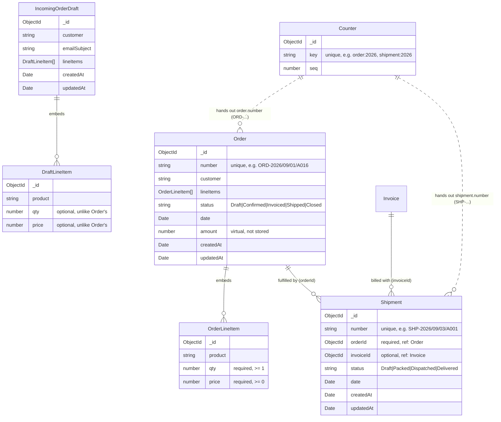
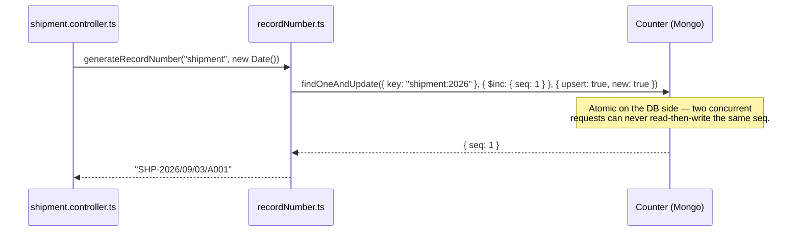

# Schema Diagram — Order, IncomingOrderDraft, Shipment & Counter

> **Scope:** the MongoDB/Mongoose schemas behind the Sales & Logistics
> modules: [`Order.ts`](../server/src/models/Order.ts),
> [`IncomingOrderDraft.ts`](../server/src/models/IncomingOrderDraft.ts),
> [`Shipment.ts`](../server/src/models/Shipment.ts), and
> [`Counter.ts`](../server/src/models/Counter.ts). See
> [`srcdesign.md`](./srcdesign.md) for the REST conventions these schemas'
> endpoints follow, and `CLAUDE.md` for how the rest of the backend fits
> together.

## 1. How the schemas relate



**The business lifecycle supported across these schemas:**

1. Inbound demand is parsed into an **`IncomingOrderDraft`**.
2. When approved, it becomes a **`Confirmed Order`** with an auto-assigned `ORD-...` number.
3. Once manufacturing completes and goods are ready for courier distribution, a **`Shipment`** is generated with dual references:
   - `orderId`: Identifies the exact customer, goods, and quantities being delivered.
   - `invoiceId`: Identifies the linked invoice/billing record (or `null` if shipped prior to invoice generation).
4. The shipment moves through the 4-stage logistics lifecycle:
   $$\text{Draft} \longrightarrow \text{Packed} \longrightarrow \text{Dispatched} \longrightarrow \text{Delivered}$$
5. Both `Order` and `Shipment` draw human-readable identifiers atomically from the shared **`Counter`** collection (`ORD-...` and `SHP-...`).

---

## 2. `Order`

| Field | Type | Notes |
|---|---|---|
| `number` | `String` | Required, **unique**. Human-readable id, e.g. `ORD-2026/09/01/A016` — see §5. Assigned once at creation; immutable after. |
| `customer` | `String` | Trimmed. |
| `lineItems` | `[OrderLineItem]` | **Embedded** sub-documents (see §2.1) — not a separate collection. Custom validator rejects an empty array: *"An order must have at least one line item."* |
| `status` | `String` | Enum: `Draft`, `Confirmed`, `Invoiced`, `Shipped`, `Closed`. Defaults to `Draft`. |
| `date` | `Date` | Required. |
| `amount` | `Number` (virtual) | **Not stored** — computed on read as `Σ(qty × price)` across `lineItems` (`orderSchema.virtual("amount")`). |
| `createdAt` / `updatedAt` | `Date` | From `{ timestamps: true }`. |

### 2.1 `OrderLineItem` (embedded sub-schema)

| Field | Type | Notes |
|---|---|---|
| `product` | `String` | Trimmed. |
| `qty` | `Number` | **Required**, `min: 1` — a line with zero or negative quantity is never valid. |
| `price` | `Number` | **Required**, `min: 0` — free (0) is allowed, negative is not. |

---

## 3. `IncomingOrderDraft`

| Field | Type | Notes |
|---|---|---|
| `customer` | `String` | Trimmed. |
| `emailSubject` | `String` | Trimmed. The subject line of the inbound email this draft was parsed from. |
| `lineItems` | `[DraftLineItem]` | Embedded sub-schema (`qty` and `price` optional during draft review). |
| `createdAt` / `updatedAt` | `Date` | From `{ timestamps: true }`. |

---

## 4. `Shipment`

| Field | Type | Notes |
|---|---|---|
| `number` | `String` | Required, **unique**. Human-readable tracking number, e.g. `SHP-2026/09/03/A001` — see §5. Assigned once atomically at creation. |
| `orderId` | `ObjectId` | Required, **`ref: "Order"`**. Foreign key linking to the source order. Populated on API reads to provide customer name, line items, and order status in a single round-trip. |
| `invoiceId` | `ObjectId` | Optional / Nullable, **`ref: "Invoice"`**. Foreign key linking to the billing invoice. Populated on API reads to provide the human-readable invoice `number`. |
| `status` | `String` | Enum: `Draft`, `Packed`, `Dispatched`, `Delivered`. Defaults to `Draft`. Validated on create and update. |
| `date` | `Date` | Ship date / scheduled delivery date. |
| `createdAt` / `updatedAt` | `Date` | From `{ timestamps: true }`. |

### 4.1 Dual Foreign Key References & Population

A `Shipment` maintains dual foreign references to tie the physical fulfillment pipeline directly with Sales and Invoicing:
* **`orderId`**: Points to the `Order` being delivered. `toPublicShipment()` handles both populated (`order.customer`, `order.lineItems`) and unpopulated ObjectId strings transparently.
* **`invoiceId`**: Points to the `Invoice` billing this order. If an invoice has not yet been issued when packing starts, `invoiceId` is stored as `null`.

```typescript
// server/src/models/Shipment.ts
const shipmentSchema = new Schema(
  {
    number: { type: String, required: true, unique: true },
    orderId: { type: Schema.Types.ObjectId, ref: "Order", required: true },
    invoiceId: { type: Schema.Types.ObjectId, ref: "Invoice", default: null },
    status: { type: String, enum: ["Draft", "Packed", "Dispatched", "Delivered"], default: "Draft" },
    date: { type: Date },
  },
  { timestamps: true }
);
```

### 4.2 Delivery Lifecycle Endpoints

Shipments support standard REST CRUD operations plus dedicated lifecycle transition actions:

```
[ Draft ] ──(Mark Packed)──> [ Packed ] ──(PATCH /dispatch)──> [ Dispatched ] ──(PATCH /deliver)──> [ Delivered ]
```

* **`POST /api/shipments`**: Creates a new shipment, draws atomic `SHP-...` number, and links `orderId` and optional `invoiceId`.
* **`PATCH /api/shipments/:id/dispatch`**: Transitions status to `"Dispatched"` when the courier van departs.
* **`PATCH /api/shipments/:id/deliver`**: Transitions status to `"Delivered"` when the customer receives the goods.
* **`PUT /api/shipments/:id`**: Updates editable fields (date, status, linked invoice).

### 4.3 Offline Manifest Caching (`offlineCache.ts`)

To ensure warehouse operators and mobile delivery drivers can view manifests in locations with weak or nonexistent internet connectivity:
* Successful responses from `GET /api/shipments` are snapshotted to browser `localStorage` under `flowerp:cache:shipments`.
* If a network drop or offline reload occurs, the UI falls back to `readCache("shipments")` and displays an **Offline Manifest Mode** banner with snapshot timestamp.
* State mutations while offline fail gracefully with user-friendly error banners, requiring a live connection to guarantee database consistency.

---

## 5. `Counter` & human-readable record numbers



| Field | Type | Notes |
|---|---|---|
| `key` | `String` | Required, **unique**. One document per (record type, year) — e.g. `"order:2026"`, `"invoice:2026"`, `"shipment:2026"`, `"job:2026"`. |
| `seq` | `Number` | Defaults to `0`; incremented atomically per call via `findOneAndUpdate`. |

`formatRecordNumber` (in [`recordNumber.ts`](../server/src/utils/recordNumber.ts)) produces structured tracking identifiers:

```
SHP-2026/09/03/A001
└┬┘ └──┬──┘ └┬┘
 │      │     └─ letter block (A001-A999, then B001, C001, ...)
 │      └─────── date the record was created
 └────────────── type prefix: ORD / INV / SHP / JOB
```

---

## 6. Verified behaviour (End-to-End Database Validation)

The following behaviors were verified against MongoDB Atlas and the live Express API:

- **Missing `orderId` validation**: `POST /api/shipments` without `orderId` or with an invalid ObjectId string $\rightarrow$ `400 Bad Request` (`"A valid orderId is required."`).
- **Invalid status validation**: `POST /api/shipments` with `status: "OnRoute"` $\rightarrow$ `400 Bad Request` with list of allowed statuses.
- **Dual foreign reference population**: `GET /api/shipments` and `GET /api/shipments/:id` return fully populated `order` (`customer`, `lineItems`, `status`) and `invoice` (`number`), or `null` when `invoiceId` is omitted.
- **Dispatch workflow**: `PATCH /api/shipments/:id/dispatch` atomically updates status to `"Dispatched"` and returns the updated populated document.
- **Deliver workflow**: `PATCH /api/shipments/:id/deliver` atomically updates status to `"Delivered"` and locks the shipment from further modification.
- **Counter sequence uniqueness**: Concurrent shipment creations draw atomic, sequential identifiers (`SHP-.../A001`, `SHP-.../A002`) without collision.
- **Offline cache fallback**: Disconnecting the network causes the shipments view to seamlessly serve the cached manifest snapshot from `localStorage` without crashing or clearing the table.

